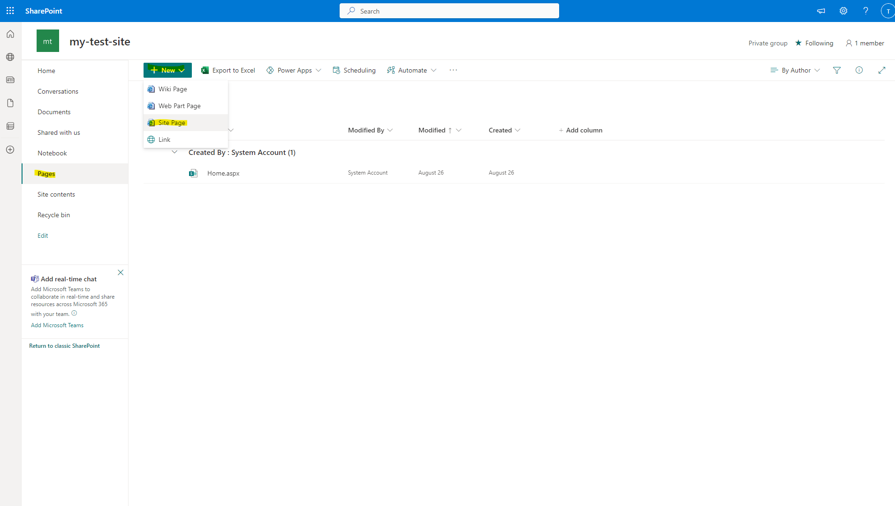

<!--Copyright (c) Laserfiche.
Licensed under the MIT License. See LICENSE in the project root for license information.-->
# Adding App to SharePoint Site

## Adding app via SharePoint store
### Prerequisites

- Be an owner of a SharePoint site you want to add the integration to.

### Initial Steps

Follow Microsoft's instructions for [adding an app to a site in SharePoint](https://support.microsoft.com/en-us/office/add-an-app-to-a-site-ef9c0dbd-7fe1-4715-a1b0-fe3bc81317cb){:target="_blank"}.

### The Laserfiche Sign In Page

1. In your SharePoint site, select the "Pages" item in the navigation bar on the left side of the page.
   
1. Create and open a new site page by clicking the "+ New" button and selecting "Site Page" from the dropdown.
1. Title the page “LaserficheSignIn”.
1. Move your cursor just below the title area to the white space beneath. This should reveal a hidden "+" button. If you hover over it, it should display the message "Add a new web part in column one”.
   
1. Click on that button and Search for “Laserfiche Sign In".
   
1. Click on the search result with a white L on an orange square. The Laserfiche Sign In web part should now appear on your Page. Before creating subsequent pages, make sure to click the 'Publish' button to save the page.

### The Repository Explorer Page

Follow the same steps as above, but title the Page whatever you wish and add the “Repository Explorer” web part.

### The Admin Configuration Page

Follow the same steps as above, but title the page whatever you wish and add the “Admin Configuration” web part instead of “Laserfiche Sign In".

### Next Steps

Before you can log in and use the web pages you just created, you will need to [Register the integration in the Laserfiche Developer Console](../register-app-in-laserfiche). After you register your Apps, you should be able to log in and use the web parts. For Documentation on how to use the integration, reference the [User Documentation](../../user-documentation/).
