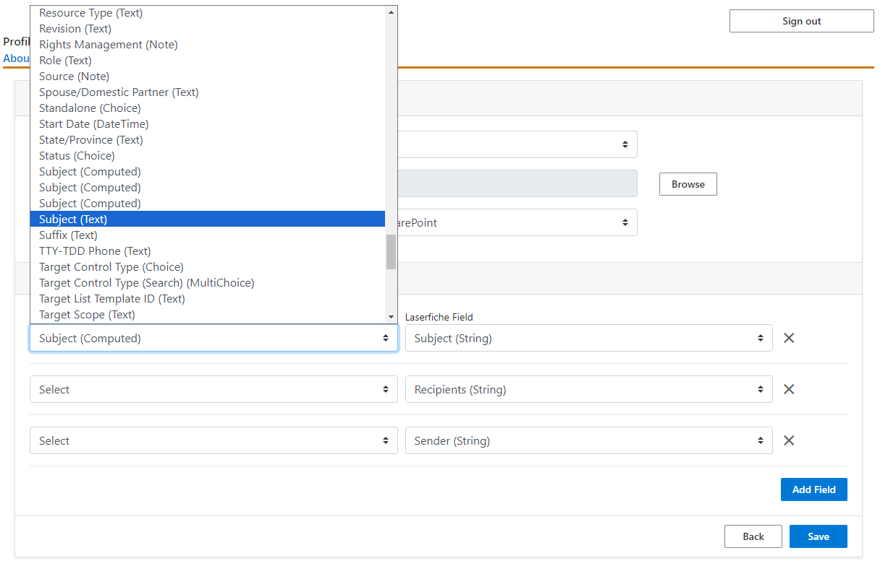
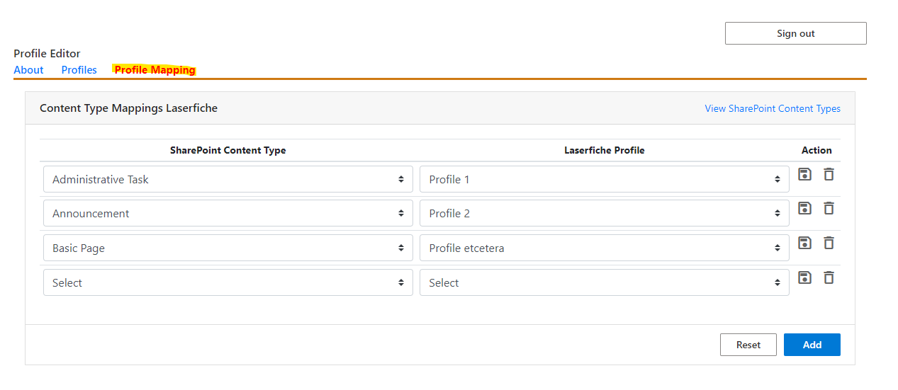

<!--Copyright (c) Laserfiche.
Licensed under the MIT License. See LICENSE in the project root for license information.-->

# Configuring Metadata Mappings

### Prerequisites

- be a Site Owner of the SharePoint Site for which the integration will be configured

## Introduction

You must configure mappings for your site before you can send documents to Laserfiche. Mappings are set based on the SharePoint Content Type of the item you are trying to save. You must set up a mapping for each SharePoint Content Type you use in your site, or set a default mapping for anything not specifically mapped that you would still like to save to Laserfiche.

A mapping allows you to specify options for how to save to Laserfiche for that Content Type, including a destination folder, a template with mapped metadata from SharePoint properties to Laserfiche fields, and what happens in SharePoint once you save to Laserfiche.

## Steps

### Create a Profile

In the "Profiles" tab of the Admin Configuration web part, click on the “Add Profile” button to add a new profile. Click on the pencil icon to edit an existing profile. Either selection will open the Profile Editor View.

### Define the Profile in the Profile Editor

- Name: this is the identifier used to associate SharePoint content types with this profile in the Profile Mapping tab.
- Laserfiche Template: If a profile is assigned a template, then all files saved to Laserfiche through that profile will be assigned that template in Laserfiche. [Learn more about templates](https://doc.laserfiche.com/laserfiche.documentation/en-us/Content/Fields_and_Templates.html){:target="_blank"}.
- Laserfiche Destination: This option specifies the path to the folder in the Laserfiche Repository where the files associated with this profile will be saved.
- After Import: This option specifies what to do with the SharePoint file after exporting it to Laserfiche.
  
- Mappings from SharePoint Column to Laserfiche Field Values - This is where the actual metadata transfer is configured. - Each Field in the template can be assigned a SharePoint column, so that when files are exported from SharePoint to Laserfiche, the file in Laserfiche will have a field with the same value as the Column of the file in SharePoint. - templates with required fields MUST have columns assigned to them. - The association between SharePoint columns and Laserfiche fields should be one-to-one, i.e., you should not attempt to map multiple SharePoint columns to the same Laserfiche field.
  

### Map Content Types to Profiles in the Profile Mapping Tab

Displays a list of SharePoint Content Types and their corresponding Laserfiche Profile. If you add a content type/profile pair, then
any SharePoint content matching that type will be assigned the corresponding profile when you attempt to save the content to Laserfiche.

### Default Profile

If you attempt to save a file to Laserfiche and it does not have a SharePoint Content Type or its SharePoint Content Type is not mapped to any Laserfiche Profile, you will not be able to save that file. You must either create a mapping for each Content Type that will exist on your site or set a default mapping which will apply to any file in SharePoint that does not have a Content Type or does not have a corresponding Laserfiche Profile for its Content Type.

