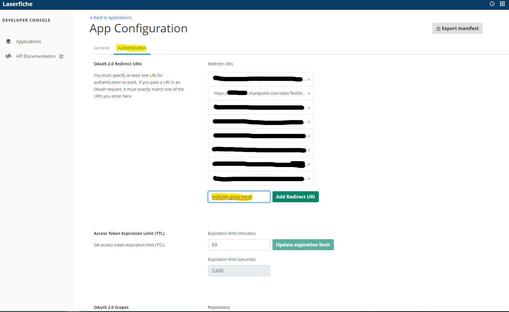

<!--Copyright (c) Laserfiche.
Licensed under the MIT License. See LICENSE in the project root for license information.-->
# Registering App in Laserfiche

### Prerequisites

- Have developer rights in your Laserfiche account.

### Steps

1. Open the [Developer Console](https://developer.laserfiche.com/developer-console.html){:target="_blank"}.
   
1. Attempt to Create a New App from Manifest, and upload the manifest provided [here](../assets/LaserficheSharePointIntegrationAppManifest.json).
   
1. If the attempt fails because an app with that client ID already exists, find the app with that client id by opening [this url](https://app.laserfiche.com/devconsole/apps/8ee987ea-a0b1-4ca2-85c4-a79b335cd214/config){:target="_blank"} in a new tab.
   
1. One way or another, an app with that client ID should now exist. Open the app and switch from the general tab to the authentication tab.
   
1. Copy the URL from your SharePoint LaserficheSignIn page, append the query parameter `?autologin` and add it to the developer console as a new redirect URI. The URI should end with `SitePages/LaserficheSignIn.aspx?autologin`.
   
    - For example, if your LaserficheSignInPage was named `https://subdomain.sharepoint.com/sites/my-test-site/SitePages/LaserficheSignIn.aspx`, then the redirect URI you would add to the Laserfiche devconsole would be `https://subdomain.sharepoint.com/sites/my-test-site/SitePages/LaserficheSignIn.aspx?autologin`.
1. You should now be able to sign in on each of the components.

### Next Steps

[Configure Metadata Mappings](./configuring-metadata-mappings) in the Admin Configuration web part
