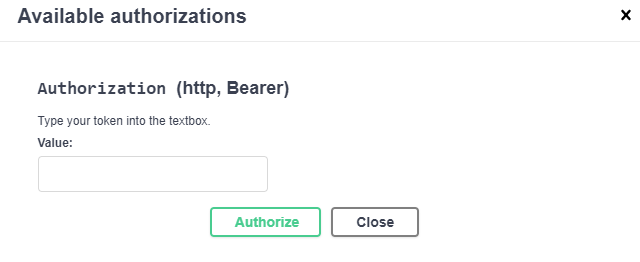
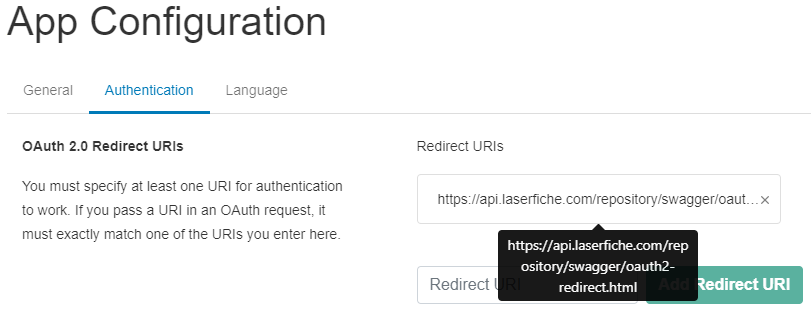
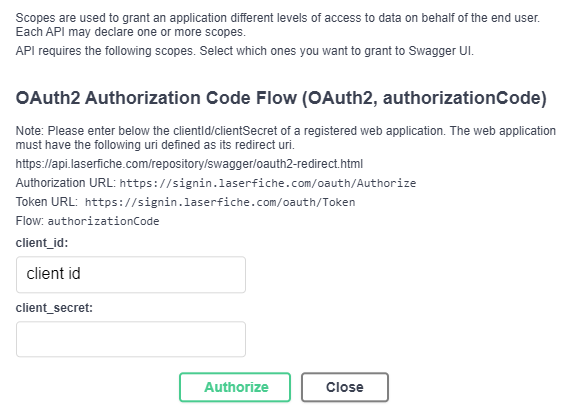

<!--Copyright (c) Laserfiche.
Licensed under the MIT License. See LICENSE in the project root for license information.-->

# Authenticate from the Swagger UI Sandbox

The Laserfiche API development team is using Swagger UI to allow you to interact with the API through a visual playground. Test out the Laserfiche API by visiting [Laserfiche REST Swagger Playground](../api/playground.html).

For Self-Hosted Laserfiche systems, learn how to [use the Swagger UI Sandbox](/api/server/index.html#authenticate).

## Using an OAuth Access Token on Swagger UI

{: .note }
**Note:** The following guide follows the OAuth model and is used by Version 1 and later of the Cloud APIs. In the sandbox, use the **Select a definition** option and select v1 or a later version to use the OAuth Access Token.

### Authorize your OAuth Service App on Swagger UI

{: .note }
**Note:** These steps can be skipped if your app is a Web App or Single-Page App.

1. Follow the guide on [Creating an OAuth Service App](guide_oauth-service.html). After going through the guide, you will have registered your service app on the Developer Console and gone through the OAuth Client Credentials Grant Flow to get an **OAuth Access Token**.
1. On the Swagger UI Sandbox, scroll to the top of the page, (switch to the **v1** or later definition for Repository API), and click **Authorize** to display the following dialog box. 
1. In the dialog box, find the **Authorization (http, Bearer)** option. Within **Value**, enter the OAuth Access Token value from step 1.
1. Click **Authorize**.
1. This will automatically add the Authorization header to your requests with the bearer token. Now you're ready to make any Laserfiche API call in the playground.

{: .note }
**Note:** The sandbox will automatically append the Bearer prefix to your OAuth Access Token. When creating your integration, please make sure the Authorization header value has *Bearer* before your OAuth Access Token, e.g., "Authorization: Bearer {*OAuth Access Token*}"

### Authorize your OAuth Web App or Single-Page App on Swagger UI

{: .note }
**Note:** These steps can be skipped if your app is a Service App.

1. Register your app on the Developer Console. For more information, follow the first section in the guide on [Creating an OAuth Web App](guide_oauth-webapp.html) or [Creating an OAuth Single-Page App](guide_oauth-spa.html) depending on your app type.
1. On the App Configuration page, add the following URI to the list of redirect URIs. The redirect URI depends on where your Laserfiche Cloud resides. 

1. **Repository API**
  - For the United States Data Center: https://api.laserfiche.com/repository/swagger/oauth2-redirect.html
  - For the Canadian Data Center: https://api.laserfiche.ca/repository/swagger/oauth2-redirect.html
  - For the European Data Center: https://api.eu.laserfiche.com/repository/swagger/oauth2-redirect.html

1. **(Preview) Table API**
  - For the United States Data Center: https://api.laserfiche.com/odata4/swagger/oauth2-redirect.html
  - For the Canadian Data Center: https://api.laserfiche.ca/odata4/swagger/oauth2-redirect.html
  - For the European Data Center: https://api.eu.laserfiche.com/odata4/swagger/oauth2-redirect.html
        

1. On the Swagger UI Sandbox, scroll to the top of the page, (switch to the **v1** or later definition for Repository API), and click **Authorize** to display the following dialog box. 
1. In the dialog box, find the **OAuth2 Authorization Code Flow** Authorization option. Within **client_id**, enter the Client ID found on the Developer Console App Configuration page. For Web Apps, also enter the Client Secret within the **client_secret** section of the dialog box. For Single-Page Apps, the client secret should be blank.
1. Click **Authorize**.
1. This will start the Authorization Code Flow and will open a new tab. You will need to sign in to Laserfiche Cloud using the same Account ID as the one used to register your app. If you are already signed in to another Laserfiche Cloud service, the browser should already have the associated Laserfiche Cloud cookies and the process will skip the sign-in step and will show the consent page in next step directly.
1. The consent page will be shown to decide whether to grant the app access to your credentials. Click **Confirm**.
1. The new tab should close automatically. Going back to the Swagger UI page, you should see you are **Authorized** now. Requests to the Laserfiche API on the Swagger UI page will now automatically add the Authorization header with the bearer token. Now you're ready to make any Laserfiche API call in the playground.

{: .note }
**Note:** The sandbox will automatically append the Bearer prefix to your OAuth Access Token. When creating your integration, please make sure the Authorization header value has *Bearer* before your OAuth Access Token, e.g., "Authorization: Bearer {*OAuth Access Token*}"