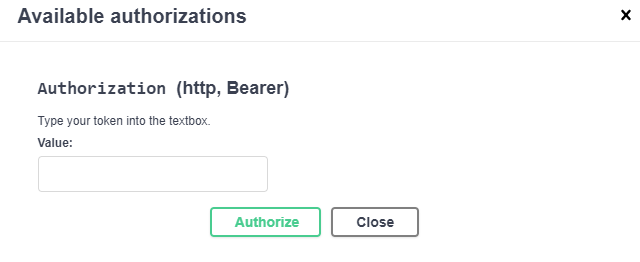
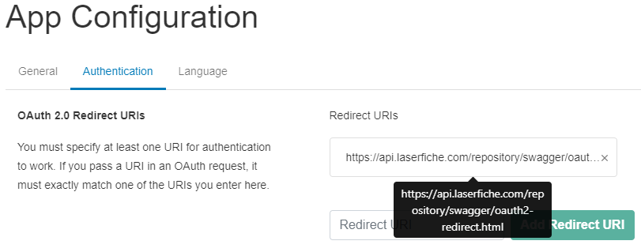
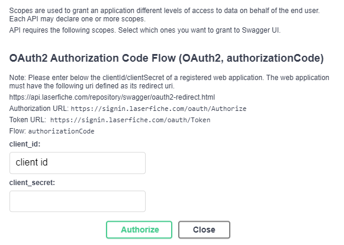

<!--© 2025 Laserfiche.
See LICENSE-DOCUMENTATION and LICENSE-CODE in the project root for license information.-->

# Authenticate from the Swagger UI Playground

The Laserfiche API development team is using Swagger UI to allow you to interact with the API through a visual playground. Test out the Laserfiche API by visiting [Laserfiche REST Swagger Playground](../../playground/).

For Self-Hosted Laserfiche systems, learn how to [use the Swagger UI Playground](../../server/#authenticating-with-the-self-hosted-laserfiche-api).

## Using an OAuth Access Token on Swagger UI

{: .note }
**Note:** The following guide follows the OAuth model and is used by Version 1 and later of the Cloud APIs. In the API playground, use the **Select a definition** option and select v1 or a later version to use the OAuth Access Token. Choose the section below based on what type of app you would like to authenticate (Service App, Wep App, or Single-Page App).

### Authorize your OAuth Service App on Swagger UI

1. Follow the guide on [Creating an OAuth Service App](../guide_oauth-service/). After going through the guide, you will have registered your service app on the Developer Console and gone through the steps to obtain either an **OAuth Access Token** or a **username and password**.
1. On the Swagger UI API Playground, scroll to the top of the page, (switch to the **v1** or later definition for Repository API), and click **Authorize** to display the following dialog box. 
1. In the dialog box
   - If you have an **OAuth Access Token**, find the **Authorization (http, Bearer)** option. Within **Value**, enter the OAuth Access Token value from step 1.
   - If you have a **username and password**, find the **Basic Authentication (http)** option. Enter the username and password values you received in step 1.
1. Click **Authorize**.
1. This will automatically add the Authorization header to your requests. Now you're ready to make any Laserfiche API call in the playground.

{: .note }
**Note:** The Swagger UI Playground will automatically add the Authorization header to any request from the playground. When creating your integration, please make sure when using an **OAuth Access Token** the Authorization header value has _Bearer_ before your OAuth Access Token, e.g., "Authorization: Bearer {_OAuth Access Token_}" and when using a Basic authentication **username and password** the Authorization header value follows the Basic authentication standard, e.g., "Authorization: Basic {_username:password (base64 encoded)_}"

### Authorize your OAuth Web App or Single-Page App on Swagger UI

1. Register your app on the Developer Console. For more information, follow the first section in the guide on [Creating an OAuth Web App](../guide_oauth-webapp) or [Creating an OAuth Single-Page App](../guide_oauth-spa) depending on your app type.
1. On the App Configuration page, add the following URI to the list of redirect URIs. The redirect URI depends on where your Laserfiche Cloud resides.

    | Data Center | Repository API redirect URI | Table API URI |
    | --- | --- | --- |
    | United States | https://api.laserfiche.com/repository/swagger/oauth2-redirect.html | https://api.laserfiche.com/odata4/swagger/oauth2-redirect.html |
    | Canada | https://api.laserfiche.ca/repository/swagger/oauth2-redirect.html | https://api.laserfiche.ca/odata4/swagger/oauth2-redirect.html |
    | Europe | https://api.eu.laserfiche.com/repository/swagger/oauth2-redirect.html | https://api.eu.laserfiche.com/odata4/swagger/oauth2-redirect.html |
    
    
1. On the Swagger UI Playground, scroll to the top of the page, (switch to the **v1** or later definition for Repository API), and click **Authorize** to display the following dialog box. 
1. In the dialog box, find the **OAuth2 Authorization Code Flow** Authorization option. Within **client_id**, enter the Client ID found on the Developer Console App Configuration page. For Web Apps, also enter the Client Secret within the **client_secret** section of the dialog box. For Single-Page Apps, the client secret should be blank.
1. Specify the scopes that you require. See [OAuth 2.0 Scopes for more details](./../guide_oauth_2.0_scopes/).
    - Note: For the table API you can only select access to global resources or a test project named "Swagger Test Project". This is only intended for testing purposes, if you need to test other scopes, use a service app or your own web app or SPA.
1. Click **Authorize**.
1. This will start the Authorization Code Flow and will open a new tab. You will need to sign in to Laserfiche Cloud using the same Account ID as the one used to register your app. If you are already signed in to another Laserfiche Cloud service, the browser should already have the associated Laserfiche Cloud cookies and the process will skip the sign-in step and will show the consent page in the next step directly.
1. The consent page will be shown to decide whether to grant the app access to your credentials. Click **Confirm**.
1. The new tab should close automatically. Going back to the Swagger UI page, you should see that you are **Authorized** now. Requests to the Laserfiche API on the Swagger UI page will now automatically add the Authorization header with the bearer token. Now you're ready to make any Laserfiche API call in the playground.

{: .note }
**Note:** The Swagger UI Playground will automatically append the Bearer prefix to your OAuth Access Token. When creating your integration, please make sure the Authorization header value has _Bearer_ before your OAuth Access Token, e.g., "Authorization: Bearer {_OAuth Access Token_}"
