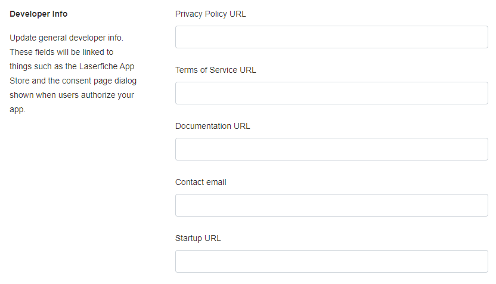
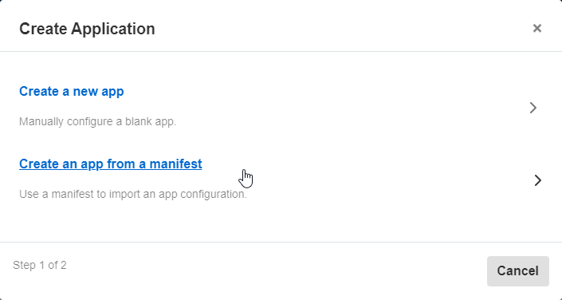
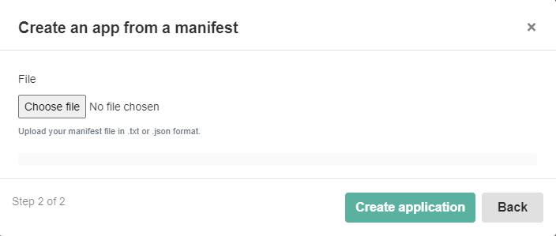
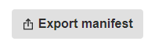

<!--Copyright (c) Laserfiche.
Licensed under the MIT License. See LICENSE in the project root for license information.-->

# Import and Export Application Manifest
{: .note }
**Note:** The following guide only applies to Laserfiche Cloud.

An application manifest is a JSON file that contains information about the application. You can use it to
          create an application in the Developer Console. Conversely, you can also export a manifest from an existing
          application.

## Add a Manifest to Your Existing Application

1. In the [Developer Console](../../../getting-started/developer-console/), click the application that you want to add manifest information
            to.
1. On the App Configuration page, in the "Developer Info" section, fill in details about your app. and save your changes. 

## Create an Application from a Manifest

1. In the [Developer Console](../../../getting-started/developer-console/), on the Applications listing page, click the **New** button to register a new application.
1. On the **Create Application** dialog box, select the **Create an app from a manifest** option.
          
1. Click **Choose file** to select the manifest file that you want to use to create the application.
          
- {: .note } **Note:** the file must be in JSON format (with extension `.json` or
            `.txt`) and contain all the required fields.
1. Use the preview to verify that the manifest file looks correct and then click **Create
            application**.
1. View the auto-created app configuration to verify that all the field values are correct and make changes as needed.

## Export a Manifest from an Existing Application

1. In the [Developer Console](../../../getting-started/developer-console/), select to the application that you want to export.
1. In the App Configuration page, click **Export manifest** in the upper right corner.
          
1. In the top right corner of the preview, click the clipboard button to save the contents of the manifest to the clipboard. You can also choose to download the manifest as a JSON file by clicking the **Download as .json file** button.