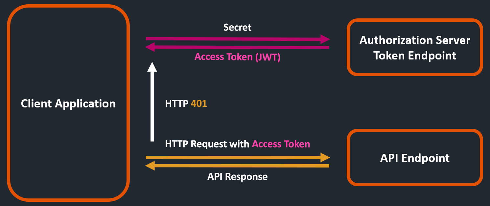

<!--© 2025 Laserfiche.
See LICENSE-DOCUMENTATION and LICENSE-CODE in the project root for license information.-->

# Overview of the Laserfiche API

## Laserfiche APIs and SDKs

The Laserfiche API allows you interact with Laserfiche services from low-code and custom-code environments.

| API / SDK                                                                                                               |                                           Laserfiche<br>Cloud                                           |                  Laserfiche<br/>Self-Hosted                  | Client Compatibility                         | Description                                                                                       |
| ----------------------------------------------------------------------------------------------------------------------- | :-----------------------------------------------------------------------------------------------------: | :----------------------------------------------------------: | -------------------------------------------- | ------------------------------------------------------------------------------------------------- |
| [Laserfiche OAuth 2.0](../authentication/)                                                                              |                                                &#x2713;                                                 |                             N/A                              | HTTP REST,<br>OAuth 2.0                      | Authorize Sign-In page and Token endpoint                                                         |
| [Collections API](../collections-api-reference/)                                                                        |                                                &#x2713;                                                 |                             N/A                              | HTTP REST,<br>Basic Authentication           | Manage vectorized document collections                                                            |
| [Laserfiche Repository API V2](../repository-api-reference/)                                                            |              &#x2713;<br/>[Changelog](https://api.laserfiche.com/repository/v2/changelog)               |                         Coming Soon                          | HTTP REST, [client libraries](../libraries/) | Interact with Laserfiche's repositories, documents, and metadata                                  |
| [Laserfiche Repository API V1](../repository-api-reference/)                                                            |              &#x2713;<br/>[Changelog](https://api.laserfiche.com/repository/v1/changelog)               | &#x2265; 11<br/>Requires [Laserfiche API Server](../server/) | HTTP REST, [client libraries](../libraries/) | Interact with Laserfiche's repositories, documents, and metadata                                  |
| [Laserfiche OData API](../odata-api-reference/)                                                                         |                                                &#x2713;                                                 |                             N/A                              | HTTP REST, OData v4                          | Access and manage data in a Laserfiche Cloud Lookup Tables                                        |
| [Laserfiche SDK](https://support.laserfiche.com/product/sdk/)                                                           |                                                &#x2713;                                                 |                           &#x2713;                           | .NET Framework 4.8                           | Interact with Laserfiche's repositories, documents, and metadata<br/>(\*) Requires an SDK license |
| [Laserfiche Workflow SDK](https://support.laserfiche.com/resources/2411/getting-started-with-the-workflow-sdk-visual-c) | N/A, see [Script Rule](https://doc.laserfiche.com/laserfiche/en-us/Content/Resources/Rules/scripts.htm) |                           &#x2713;                           | .NET Framework 4.8                           | Extend the functionality of Laserfiche Workflow with custom code<br/>(\*) Requires an SDK license |

## Laserfiche REST API - Cloud vs Self-Hosted

|                                 | Laserfiche Cloud                                                                                                                                                                                                                                                                                                                                                                                                | Laserfiche<br/>Self-Hosted                                                                                                  |
| ------------------------------- | --------------------------------------------------------------------------------------------------------------------------------------------------------------------------------------------------------------------------------------------------------------------------------------------------------------------------------------------------------------------------------------------------------------- | --------------------------------------------------------------------------------------------------------------------------- |
| API Endpoints                   | - [Canada](../playground/) Data Center<br/> - [European Union](../playground/) Data Center<br/> - [United States](../playground/) Data Center                                                                                                                                                                                                                                                                   | Self-Hosted [Laserfiche API Server](../server/)                                                                             |
| API Explorer                    | [Swagger Playground](../playground/)                                                                                                                                                                                                                                                                                                                                                                            | [Swagger UI](https://swagger.io/tools/swagger-ui/) at<br/>https://[YOUR-LASERFICHE-API-SERVER](../server/)/LFRepositoryAPI/ |
| Authentication<br/>Frameworks   | - OAuth 2.0 client_credentials (Service Principals)<br/>- OAuth 2.0 authorization_code & refresh_token (User Sign-in Page)<br/>- HTTP Basic supported for [Laserfiche OData API](../odata-api-reference/)                                                                                                                                                                                                       | - Token endpoint (username & password)<br/> - Coming soon: User Sign-in Page                                                |
| Authentication<br/>User Types   | - [Full](https://doc.laserfiche.com/laserfiche/en-us/Content/userlicensetypes.htm) Users<br/> - [Participant](https://doc.laserfiche.com/laserfiche/en-us/Content/userlicensetypes.htm) Users (Read Only Access)<br/> - [Community](https://doc.laserfiche.com/laserfiche/en-us/Content/userlicensetypes.htm) Users (Read Only Access)<br/> - [Service Principals](../authentication/guide_service-principals/) | - LFDS Users<br/>- Repository Users<br/>- Keyed Integrator Licenses                                                         |
| OAuth 2.0<br/>Application Types | - [Service App](../authentication/guide_oauth-service/)<br/>- [SPA (Single Page App)](../authentication/guide_oauth-spa/)<br/>- [Web App](../authentication/guide_oauth-webapp/)                                                                                                                                                                                                                                | N/A                                                                                                                         |
| Security features               | - JWT Access Token<br/>- [OAuth 2.0 Scopes](../authentication/guide_oauth_2.0_scopes/)<br/>- User Consent Form on first Sign-in (can be disabled)<br/>- [Requires App registration in Developer Console](../../getting-started/developer-console/)                                                                                                                                                              | - JWT Access Token                                                                                                          |
| Service Limits                  | [API Limits](../../getting-started/guide_api-limits/)                                                                                                                                                                                                                                                                                                                                                           | N/A                                                                                                                         |

## Laserfiche REST API - HTTP Requests

API requests need to include valid information for verifying the identity of a user or a client. Bearer authentication (also called token authentication) is an HTTP authentication scheme that involves security tokens called **bearer Access Tokens** encoded as [JSON Web Token (JWT)](https://datatracker.ietf.org/doc/html/rfc7519). The name “Bearer authentication” can be understood as “give access to the bearer of this token.” Access Tokens are generated by the authorization server in response to a login request.
The client must send this token in the **Authorization header** when making requests to the API endpoint:

```txt
Authorization: Bearer <JWT Access Token>
```



All Laserfiche API request URLs can be broken down in the following parts:

**{HTTP method} https://{host}/{API set}/{version}/{resource}?{query parameters}**

- [{HTTP method}](#http-method) — The HTTP method used for the request
- {host} — The host name of the Laserfiche Cloud API `api.laserfiche.com`, `api.laserfiche.ca`, `api.eu.laserfiche.com`, etc.
- [{API set}](#api-set) — The API set
- [{version}](#version) — The API version to use (for Repository API only)
- [{resource}](#resource) — The path to the Laserfiche resource that you're referencing
- [{query parameters}](#query-parameters) — Optional OData query options or REST method parameters that customize the response

### HTTP Method

The HTTP method is also known as an HTTP verb.

| Method | Description                                 | Idempotent | Semantic               |
| ------ | ------------------------------------------- | ---------- | ---------------------- |
| GET    | Read data from the specified resource       | X          | Read, Search           |
| POST   | Create a new resource, or perform an action |            | Create, Perform action |
| PATCH  | Update a resource with new values           | ---        | Update                 |
| PUT    | Replace a resource with a new one           | ---        | Replace                |
| DELETE | Remove a resource                           | X          | Delete                 |

- GET and DELETE calls will not contain an HTTP request body
- POST, PATCH, and PUT may require an HTTP request body, typically in JSON format.

### API Set

API sets are used to help organize the Laserfiche API and often correspond to distinct sub-services or applications in the Laserfiche suite. API set names are lowercase, follow the rules for DNS labels, and are usually singular nouns.
Currently the Laserfiche API supports two API sets:

- The `repository` API set allows you to interact with the Laserfiche Cloud repository.
- The `table` API set allows you to interact with Laserfiche lookup tables using OData protocol version 4.

### Version

Every API for a service has an API version. The version component is of the form `v{version}-{alpha|beta}{revision}`. The `{revision}` portion is optional and may only appear if the alpha or beta suffixes are used. Examples:

- `v1` Version 1, stable API, no incompatible changes.
- `v1-beta` Version 1 beta, not a stable API, but expect only minor changes, typically kept for two releases.

The API versions of each service are independent of each other, and so a single client may be invoking v1 of the API for the account service, but the v2 and v3 API for the repository service, for example. A service does not necessarily have a stable API version. The interpretation of "alpha" and "beta" in the API shall follow the rules listed above and is separate from non-technical marketing language concerning related features or releases.

There is currently only one version of the Table API and a version is not currently specified in the request.

#### Stable API Versions

A stable API is one that will not change in a potentially incompatible way, either in how requests are processed, or in the format of responses that are returned for an API call. Laserfiche will commit to supporting at least the latest and previous stable versions of an API, or all the versions released in the last year, whichever is greater. The revision suffix is only used with the alpha and beta tags, and denotes a revision number (minor version). Its use is optional but recommended, especially for beta versions.

#### Alpha API Versions

The alpha tag indicates that the API is undergoing heavy development and will probably be retired as soon as the next version of the API is released. APIs marked as alpha may:

- Be removed with or without notice
- Have odd quirks or use experimental patterns that deviate from standard practice

#### Beta API Versions

The beta tag indicates that the API is undergoing only minor revision and will generally be kept around for another revision so that users do not need to migrate immediately to the next stable API. APIs marked as beta are:

- May be subject to minor changes that would not break most applications, but prior warning is provided
- Possibly not well-documented
- Kept around until after the next stable version is published

### Resource

Resources in Laserfiche Cloud are represented in the URL of the API call. The naming convention for Laserfiche-defined resources are upper case, plural nouns that are typically followed by a unique identifier. Multiple resources are strung together to show the hierarchical relationship between them. For example:

Repository API: `GET https://api.laserfiche.com/repository/v1/Repositories/r-abc123/Entries/888`

After the `v1` version, the resource can be interpreted as "in the repository resource with id r-abc123, the entry resource with id 888."

For the Table API, the resources are user-defined. For example:

Table API: `GET https://api.laserfiche.com/odata4/table/MyTable('{1}')`

After the `table` segment, the resource can be interpreted as "in the MyTable resource with row key 1." _MyTable_ is the name of a Laserfiche lookup table.

### Query Parameters

Query parameters attached to the end of a request can alter the behavior of the API calls. Some calls support standard OData query parameters, and some API calls may have additional custom query parameters specific to the call. To learn more about specific OData query parameters, see [this example](../../guides/documents-and-folders/guide_get-folder-listing/#customizing-the-listing-response-with-query-parameters) on retrieving an entry listing from a folder.

## API Responses

After issuing a request to Laserfiche API endpoint, the response will include:

- HTTP response status code
- Response body

### HTTP Response Status Code

The code will indicate the outcome of the request.

### Response Body

The body of the response will typically be in JSON or XML format. It will contain the requested data of the resource or the result of the request.

Paging

In some cases, a response body can return a large amount of data that would be inconvenient to try and return in a single response. In these cases, an OData `NextLink` is generated at the end of the request of body. This link can be used to request the next set of results from the original request.

### Next Steps

- Learn how to [get a user access token](../authentication/).
- Learn how to [import a document into your repository](../../guides/documents-and-folders/guide_importing-documents/).
- Learn how to [create folders in your repository](../../guides/documents-and-folders/guide_creating-folders/).
- Learn how to [assign values to Laserfiche fields](../../guides/metadata/guide_write-field-values/).
- Check out additional [Guides](../../guides/) for more walk-throughs and tutorials about the Laserfiche API.
