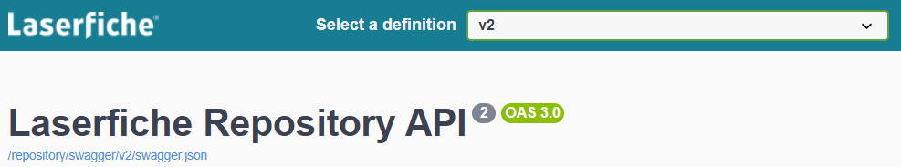

<!--© 2025 Laserfiche.
See LICENSE-DOCUMENTATION and LICENSE-CODE in the project root for license information.-->

# Laserfiche API Swagger Playground

The Swagger Playground is a visual, interactive documentation tool that allows developers to explore and test REST APIs using a browser. Visit the [Swagger UI](https://swagger.io/tools/swagger-ui/) for more information.

{: .note }
**WARNING:** Swagger Playground API calls are **_live_** and can delete or modify resources in the connected system.

See guide: [Authenticate from the Swagger UI Playground](../authentication/guide_authenticating-to-the-swagger-playground/)

## Laserfiche OAuth 2.0 Authorization Server API

- The OAuth 2.0 **Authorize** endpoint sign-in page allows users to authenticate and grant permission for a third-party application to access their protected resources. The **Authorization Code** returned by a successful authorization process is typically exchanged with an **Access Token** using the **Token** endpoint.
- The OAuth 2.0 **Token** endpoint is used to request an API **Access Token**.

### Laserfiche OAuth 2.0 Authorization Server API regional endpoints

- [Try the OAuth API](https://signin.laserfiche.com/oauth/swagger/index.html) (United States Data Center)
- [Try the OAuth API](https://signin.laserfiche.ca/oauth/swagger/index.html) (Canadian Data Center)
- [Try the OAuth API](https://signin.eu.laserfiche.com/oauth/swagger/index.html) (European Data Center)

{: .note }
**Note:** The **Authorize** endpoint is not region specific but, based on the Laserfiche Cloud Account ID used to sign-in, it generates a region specific **Authorization Code** to be used with the corresponding region specific **Token** endpoint.

## Laserfiche Repository API

Use the Laserfiche Repository API to access data in a Laserfiche repository. You can import or export files, modify the repository folder structure, read and modify templates and field values, and more.

### Laserfiche Self-Hosted Repository API endpoint

- Self-Hosted [Laserfiche API Server](../server/) typically exposes the Swagger UI at `https://YOUR-SERVER.EXAMPLE.COM/LFRepositoryAPI/`.

### Laserfiche Cloud Repository API regional endpoints

- [Try the Repository API](https://api.laserfiche.com/repository/swagger/index.html) (United States Data Center)
- [Try the Repository API](https://api.laserfiche.ca/repository/swagger/index.html) (Canadian Data Center)
- [Try the Repository API](https://api.eu.laserfiche.com/repository/swagger/index.html) (European Data Center)

{: .note }
**Note:** Repository API V2 offers enhanced functionality compared to V1 and is the recommended version.

## Laserfiche Cloud OData Table API

Use the [Laserfiche OData Table API](../odata-api-reference/) to access and manage data in a Laserfiche Lookup Tables.

- [Try the OData Table API API](https://api.laserfiche.com/odata4/swagger/index.html) (United States Data Center)
- [Try the OData Table API API](https://api.laserfiche.ca/odata4/swagger/index.html) (Canadian Data Center)
- [Try the OData Table API API](https://api.eu.laserfiche.com/odata4/swagger/index.html) (European Data Center)
