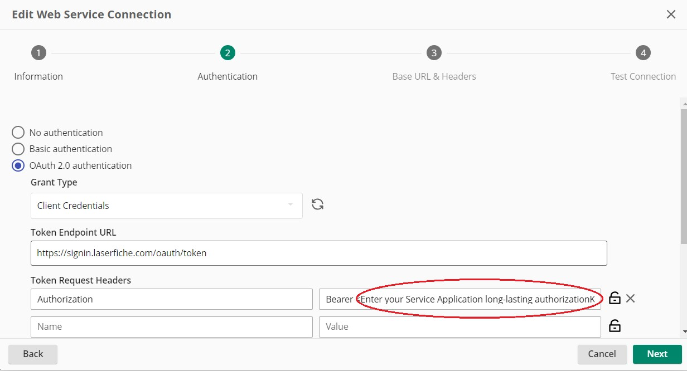

<!--© 2024 Laserfiche.
See LICENSE-DOCUMENTATION and LICENSE-CODE in the project root for license information.-->

# {{ page.title }}

{: .note }
**Note:** Applies to: Laserfiche Cloud.

Accessing the Laserfiche Cloud APIs requires setting up a Service Application in the Laserfiche Developer Console.

Follow the steps below to obtain the credentials needed to configure [Web Service Connections](https://doc.laserfiche.com/laserfiche.documentation/en-us/Default.htm?_gl=1*131rcwp*_gcl_au*NzQ5MzM2MDY0LjE3MzMzMzk1NzM.#../Subsystems/ProcessAutomation/Content/Resources/Integrations/Web-Services.htm?TocPath=Process%2520Automation%257CIntegrations%257C_____5) used by Web Request Rules to access Laserfiche Cloud APIs:

- [Laserfiche Repository API v2](./../../api/playground/#laserfiche-repository-api).
- [Laserfiche OData Table API](./../../api/odata-api-reference/)

## 1. Create a Service Application in the Laserfiche Developer Console

- You'll need to select an existing Service Principal account, or create a new one, and then generate a Service Principal Key (record the key string, you'll need it later). Review our [dedicated guide](./../../api/authentication/guide_service-principals/) on this topic for more details.

{: .note }
**Note:** The Service Principal account must be granted the roles needed to access resources to be exposed via Laserfiche API. For more information see [Repository Security](https://doc.laserfiche.com/laserfiche.documentation/en-us/Default.htm#Security.htm?TocPath=Documents%257CRepository%2520Security%257C_____0).

- Create a Service App in the Laserfiche Developer Console to represent the integration with Laserfiche Cloud API. Follow instructions [here](./../../api/authentication/guide_oauth-service/). You must select the **long-lasting Authorization Key** option when creating the Authorization Key.

{: .note }
**Note:** The security scopes required to access Laserfiche resources, for example `repository.Read repository.Write project/Global table.Read table.Write` must be configured in the Service App and included in the credentials. For more information see [OAuth 2.0 Scopes for Laserfiche APIs](./../../api/authentication/guide_oauth_2.0_scopes/).

## 2. Create or import a Laserfiche Cloud API Web Service Connection

### Laserfiche Repository API Web Service Connection

- [Laserfiche API US Cloud - Web Service Connection.dsi](./assets/laserfiche-api-us-cloud-web-service-connection.dsi)
- [Laserfiche API Canada Cloud - Web Service Connection.dsi](./assets/laserfiche-api-canada-cloud-web-service-connection.dsi)
- [Laserfiche API Europe Cloud - Web Service Connection.dsi](./assets/laserfiche-api-europe-cloud-web-service-connection.dsi)

### Laserfiche OData Table API Web Service Connection

- [Laserfiche API OData Table US Cloud - Web Service Connection.dsi](./assets/laserfiche-api-odata-table-us-cloud-web-service-connection.dsi)
- [laserfiche-api-odata-table-canada-cloud-web-service-connection.dsi](./assets/laserfiche-api-odata-table-canada-cloud-web-service-connection.dsi)
- [Laserfiche API OData Table Europe Cloud - Web Service Connection.dsi](./assets/laserfiche-api-odata-table-europe-cloud-web-service-connection.dsi)

## 3. Configure Web Service Connection

1. Authentication step: Replace the Bearer value placeholder text `<Enter your Service Application long-lasting authorizationKey from Developer Console>` with the long-lasting **_authorizationKey_** generated for your Service App.

2. Authentication step: Specify the [scopes](./../../api/authentication/guide_oauth_2.0_scopes/) required to access the underlining resources.

{: .note }
**Note:** The security scopes required by the Web Request Rules, for example `repository.Read repository.Write project/Global table.Read table.Write` must be configured both in the Service App and in the Web Service Connection. For more information see [OAuth 2.0 Scopes for Laserfiche APIs](./../../api/authentication/guide_oauth_2.0_scopes/).

3. Authentication step: Test and Save the Web Service Connection

{: .note }
**Note:** Laserfiche Cloud API Web Service Connection is now ready to be used. Verify that the appropriate Web Request Rules are configured to use this connection.
