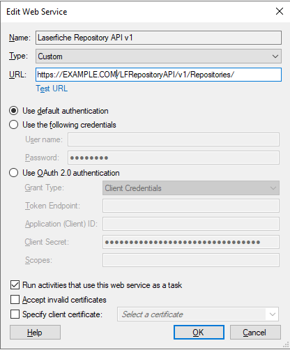
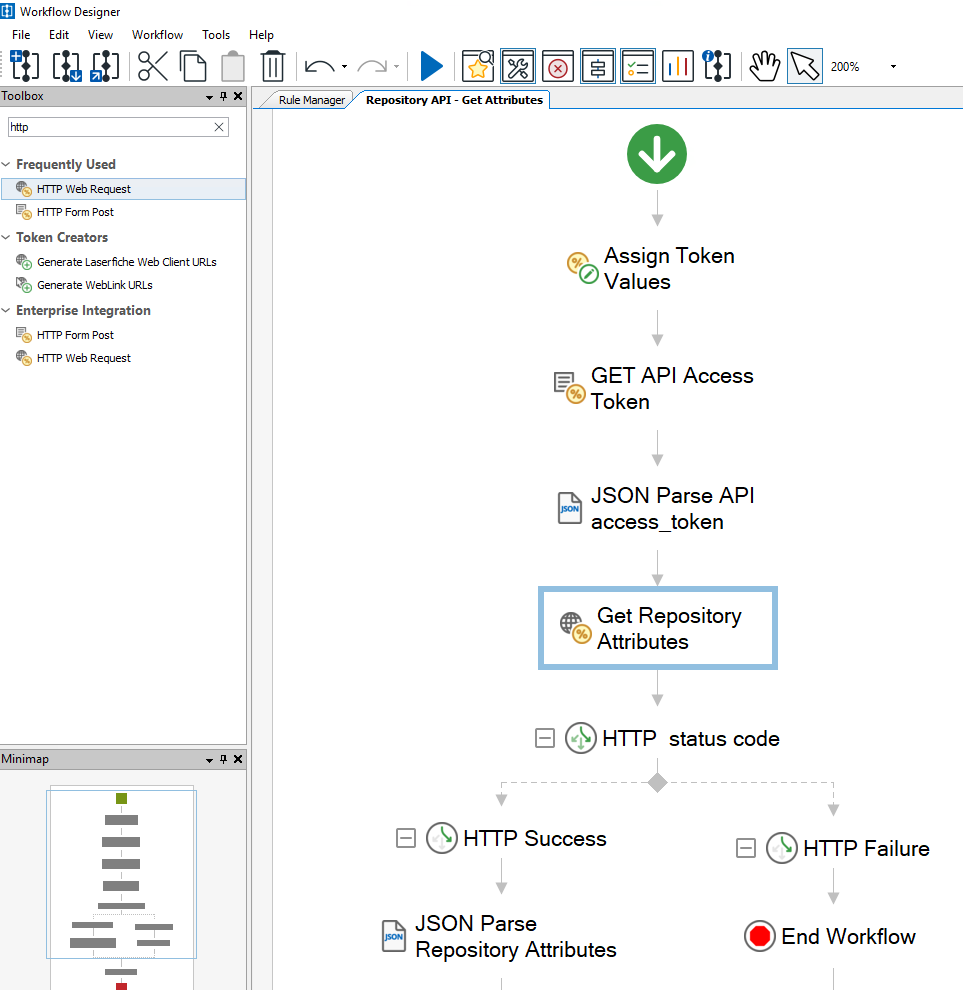
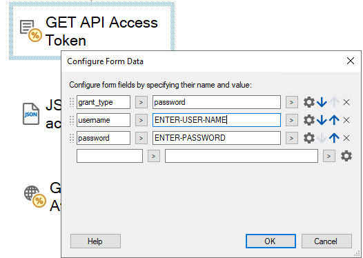

<!--© 2025 Laserfiche.
See LICENSE-DOCUMENTATION and LICENSE-CODE in the project root for license information.-->

# {{ page.title }}

License: [MIT](https://github.com/Laserfiche/laserfiche.github.io/blob/1.x/LICENSE-CODE)

{: .note }
**Note:** Applies to: Laserfiche 11, Laserfiche 12.

Laserfiche Workflow example to call a [Self-Hosted Laserfiche API Server](https://developer.laserfiche.com/docs/api/server/) endpoint.

Use cases:

- Accessing Self-Hosted Laserfiche API features that may not be available via built in [Laserfiche Workflow activities](https://doc.laserfiche.com/laserfiche.documentation/12/userguide/en-us/content/process-automating-with-workflow.htm).

## 1. Create a Web Connection

- Create a Workflow [Web Service](https://doc.laserfiche.com/laserfiche.documentation/12/userguide/en-us/content/process-web-services.htm).

- Configure the Web Service URL to point to your Laserfiche API Server.

## 2. Add Laserfiche API HTTP Activities to your Workflow

- Laserfiche Workflow - Repository API example [download](./assets/laserfiche-repository-api-workflow.wfx):

  

- Setting the Laserfiche API credentials in the 'GET API Access Token' Activity:

  
