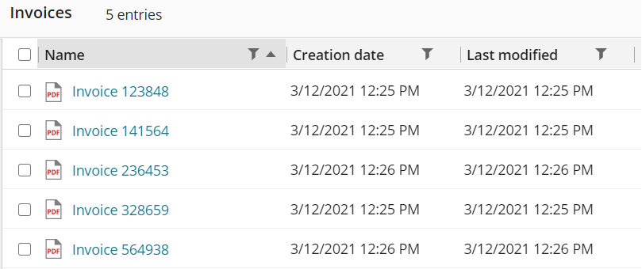

<!--Copyright (c) Laserfiche.
Licensed under the MIT License. See LICENSE in the project root for license information.-->
      

# Get Folder Contents (V2)

{: .note }
To see the guide for V1, click [here](../guide_get-folder-listing/).

Folders are the basis for organizing all of the content in your repository. In this guide, we will review how to retrieve the contents of a folder. The following GET API is used to return the list of entries of a specified folder.

## Retrieving a List of Documents

```xml
GET https://api.laserfiche.com/repository/v2/Repositories/{repositoryId}/Entries/{entryId}/Folder/Children
```

For this example scenario, we will retrieve the list of entries from a folder called Invoices. Here's what the listing would look like when viewed in the Laserfiche web client.



There is no request body for this API since it is a GET request.

```xml
GET https://api.laserfiche.com/repository/v2/Repositories/r-abc123/Entries/54/Folder/Children
```

  - The entry ID `54` in the request URL represents the ID of the folder we want to retrieve its content, in this case, the "Invoices" folder.

A successful request will return a 200 HTTP response status code with the following response body (truncated for the sake of space).

```xml
HTTP 200 OK
{
  "@odata.context": "https://api.laserfiche.com/repository/v2/$metadata#Collection(Laserfiche.Repository.Entry)",
  "value": [
    {
      "@odata.type": "#Laserfiche.Repository.Document",
      "id": 20393,
      "isContainer": false,
      "isLeaf": true,
      "name": "Invoice 123848",
      "parentId": 54,
      "fullPath": "\\Accounts Payable\\Invoices\\Invoice 123848",
      "folderPath": "\\Accounts Payable\\Invoices",
      "creator": "Guide User",
      "creationTime": "2021-03-12T20:25:55Z",
      "lastModifiedTime": "2021-03-12T20:25:56Z",
      "entryType": "Document",
      "templateName": null,
      "templateId": 0,
      "volumeName": "DEFAULT000000",
      "rowNumber": 1
    },
    {
      "@odata.type": "#Laserfiche.Repository.Document",
      "id": 20391,
      "isContainer": false,
      "isLeaf": true,
      "name": "Invoice 141564",
      "parentId": 54,
      "fullPath": "\\Accounts Payable\\Invoices\\Invoice 141564",
      "folderPath": "\\Accounts Payable\\Invoices",
      "creator": "Guide User",
      "creationTime": "2021-03-12T20:25:34Z",
      "lastModifiedTime": "2021-03-12T20:25:34Z",
      "entryType": "Document",
      "templateName": null,
      "templateId": 0,
      "volumeName": "DEFAULT000000",
      "rowNumber": 2
    },
          etc...
  ]
}
```

  - The `@odata.context` property (and similarly the `@odata.type` property) in the response body represents the URL of the OData data model for the returned entity. This is an implementation detail of OData, and can be ignored for functional purposes of the API.
  - The `value` property in the response body is an array of JSON objects, each representing an entry in the folder listing.

## Retrieve Field Metadata for each Document

We can add on to the example scenario and also retrieve field metadata for each document by using the `fields` query parameter. In this example, we will get the `Amount` and `Date` fields for each document.

```xml
GET https://api.laserfiche.com/repository/v2/Repositories/r-abc123/Entries/54/Folder/Children?fields=Amount&fields=Date
```

The response will look like the following (again, truncated for space).

```xml
HTTP 200 OK
{
  "@odata.context": "https://api.laserfiche.com/repository/v2/$metadata#Collection(Laserfiche.Repository.Entry)",
  "value": [
    {
      "@odata.type": "#Laserfiche.Repository.Document",
      "id": 20393,
      "isContainer": false,
      "isLeaf": true,
      "name": "Invoice 123848",
      "parentId": 54,
      "fullPath": "\\Accounts Payable\\Invoices\\Invoice 123848",
      "folderPath": "\\Accounts Payable\\Invoices",
      "creator": "Guide User",
      "creationTime": "2021-03-12T20:25:55Z",
      "lastModifiedTime": "2021-03-12T20:25:56Z",
      "entryType": "Document",
      "templateName": null,
      "templateId": 0,
      "volumeName": "DEFAULT000000",
      "rowNumber": 1,
      "fields": [
        {
          "id": 20,
          "name": "Amount",
          "fieldType": "Number",
          "isMultiValue": false,
          "isRequired": false,
          "hasMoreValues": false,
          "values": [
            "5000"
          ]
        },
        {
          "id": 25,
          "name": "Date",
          "fieldType": "Date",
          "isMultiValue": false,
          "isRequired": false,
          "hasMoreValues": false,
          "values": [
            "2021-03-12T00:00:00"
          ]
        }
      ]
    },
    {
      "@odata.type": "#Laserfiche.Repository.Document",
      "id": 20391,
      "isContainer": false,
      "isLeaf": true,
      "name": "Invoice 141564",
      "parentId": 54,
      "fullPath": "\\Accounts Payable\\Invoices\\Invoice 141564",
      "folderPath": "\\Accounts Payable\\Invoices",
      "creator": "Guide User",
      "creationTime": "2021-03-12T20:25:34Z",
      "lastModifiedTime": "2021-03-12T20:25:34Z",
      "entryType": "Document",
      "templateName": null,
      "templateId": 0,
      "volumeName": "DEFAULT000000",
      "rowNumber": 2,
      "fields": [
        {
          "id": 20,
          "name": "Amount",
          "fieldType": "Number",
          "isMultiValue": false,
          "isRequired": false,
          "hasMoreValues": false,
          "values": [
            "4000"
          ]
        },
        {
          "id": 25,
          "name": "Date",
          "fieldType": "Date",
          "isMultiValue": false,
          "isRequired": false,
          "hasMoreValues": false,
          "values": [
            "2021-03-13T00:00:00"
          ]
        }
      ]
    },
            etc...
  ]
}
```

{: .note }
**Note:** A maximum of 10 fields can be requested. Also, if the field is a multi-value field, only the first field value is returned. If there are more field values, then the `hasMoreValues` property will be set to `true`. Finally, null or empty field values should not be used to determine if a field is assigned to the entry.

The field values can be formatted using the `formatFields` query parameter. It will format using a default culture if none is requested.

```xml
GET https://api.laserfiche.com/repository/v2/Repositories/r-abc123/Entries/54/Folder/Children?fields=Amount&fields=Date
    &formatFields=true&culture=fr-FR
```

## Customizing the Listing Response with Query Parameters

In the above example, the returned listing contained the default set of properties for entries. However, you can customize which properties you want returned in the listing using the `$select` OData query parameter.

We will retrieve the listing from the same Invoices folder, but this time we want the file extension of the documents in the listing.

```xml
GET https://api.laserfiche.com/repository/v2/Repositories/{repositoryId}/Entries/{entryId}/Folder/Children?$select=extension
```

The response will look like the following (again, truncated for space).

```xml
HTTP 200 OK
{
  "@odata.context": "https://api.laserfiche.com/repository/v2/$metadata#Collection(Laserfiche.Repository.Entry)",
  "value": [
    {
      "@odata.type": "#Laserfiche.Repository.Document",
      "id": 20393,
      "name": "Invoice 123848",
      "entryType": "Document",
      "rowNumber": 1,
      "extension": "pdf"
    },
    {
      "@odata.type": "#Laserfiche.Repository.Document",
      "id": 20391,
      "name": "Invoice 141564",
      "entryType": "Document",
      "rowNumber": 2,
      "extension": "pdf"
    },
          etc...
  ]
}
```

{: .note }
**Note:** When using the `$select` OData query parameter, the response will only include the properties specified in the parameter, plus a set of base properties that are always returned: `@odata.type`, `id`, `name`, `entryType`, and `rowNumber`. If a property defined in the $select query parameter is not applicable to an entry in the listing, the property will be ignored.

Different properties are supported for different entry types. Note that you may include multiple properties, in a comma-separated format, in the `$select` OData query parameter.

Here is the list of default properties that can apply to *all entry types*. Note that when the `$select` OData query parameter is not used, all of these properties are returned by default.
| --- |
| `id` |
| `name` |
| `parentId` |
| `fullPath` |
| `folderPath` |
| `creator` |
| `creationTime` |
| `lastModifiedTime` |
| `entryType` |
| `templateName` |
| `templateId` |
| `volumeName` |
| `rowNumber` |
| `isContainer` |
| `isLeaf` |

Here is the list of properties specific to the *Document* entry type that you can `$select` on.
| --- |
| `extension` |
| `electronicDocumentSize` (in bytes) |
| `isElectronicDocument` |
| `isRecord` |
| `mimeType` |
| `pageCount` |
| `isCheckedOut` |
| `isUnderVersionControl` |

Here is the list of properties specific to the *Shortcut* entry type that you can `$select` on.

| --- |
| `extension` (of the shortcut target) | 
| `targetType` (entry type of the shortcut target) |
| `targetId` (entry Id of the shortcut target) |
| `isRecordFolder` (if the shortcut target is a record folder) |

Here is the list of properties specific to the *Folder* entry type that you can `$select` on.

| --- |
| `isRecordFolder` | 
| `isUnderRecordSeries` |  