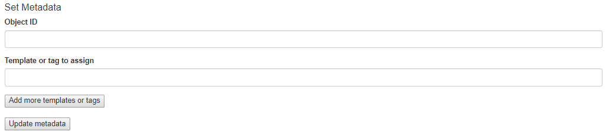

<!--© 2026 Laserfiche.
See LICENSE-DOCUMENTATION and LICENSE-CODE in the project root for license information.-->

# Assigning Templates and Tags

Using the [browser binding](../../the-browser-binding/), you can write JavaScript web applications that can interact with different CMIS-compatible content management systems. This tutorial describes a web application that lets users assign templates and tags to entries.

The sample code in this application is very similar to that for [setting field values](../setting-field-values/), except that the property values and IDs must be passed to the repository in a different format. As with updating field values, we update templates and tags using a HTML form. However, we have to submit a multi-value property rather than a single-valued property because Laserfiche templates and tags are object types in the CMIS specification, whereas field values are properties of an object. For a full version of the code, see **cmis\_query-assign-template-tag.html** and **cmis\_query-assign-template-tag.js**.

As with the code for setting field values, we incorporate the HTML form for assigning templates and tags into the page for [querying a repository](../querying-a-laserfiche-repository/), explained elsewhere. This allows you to easily check that your desired changes took place by querying the repository right after making your changes. You can also query the repository before making your changes to determine the appropriate object ID  for the object you wish to update. The service URL and repository ID are hard-coded in the JavaScript code sample, so you should change them to suit your own configuration.

We have also included an option to assign more than one template or tag at once. Clicking the **Add more templates or tags** button adds a new pair of object ID and template/tag fields. This is particularly useful because documents are allowed to have multiple tags in addition to a template, but our `submit` operation on this form does not preserve existing templates or tags. If you want the document to keep its existing templates or tags in addition to the new ones you specify, you should include its existing templates or tags among the form inputs. Note that the operation only works with templates or tags that have already been defined by a repository administrator.

The portion of the page that allows you to assign templates and tags should look as follows:

            

## Updating a multi-value property

Templates and tags are [secondary object-types](http://docs.oasis-open.org/cmis/CMIS/v1.1/errata01/os/CMIS-v1.1-errata01-os-complete.html#x1-690009) in the CMIS specification. You can add a template or tag to an object by changing the `cmis:secondaryObjectTypeIds` property of an object.

To update `cmis:secondaryObjectTypeIds`, we submit a [multi-value property](http://docs.oasis-open.org/cmis/CMIS/v1.1/errata01/os/CMIS-v1.1-errata01-os-complete.html#x1-63600012) through an HTML form. For the specific case of assigning templates and tags, the multi-value property must take the following form:

- One of the inputs must have the name `propertyId[0]` and the value `cmis:secondaryObjectTypeIds`. This indicates that the values to be specified in `propertyValue[0][i]` will all be secondary object-types.
- The templates and tags to be assigned will hvae input names of the format `propertyValue[0][i]`. For example, I can submit a form with the input name `propertyValue[0][0]` with the value `tag:Important`, together with the input name `propertyValue[0][1]` with the value `template:General`. This means that the request is setting the document in question to have the tag "Important" and the template "General".

The HTML code for the form is excerpted below. It shows only one input field initially, but includes a button that allows you to add more input fields if you wish to assign multiple templates or tags at once. 

```
<h4>Set Metadata</h4>
<form id='updateMetadata' action="" target="createresultframe" enctype="multipart/form-data" onsubmit="updateObjUrl()" method="post">
	<div class="form-group">
		<label for="objectID">Object ID</label>
		<input class="form-control" name='objectId' id='objectId' required='required' />
	</div>
	<div class="form-group" id="templateTag">
		<label for="property">Template or tag to assign</label>
		<input class="form-control" name="propertyValue[0][0]" id='property' />
	</div>
	<button id="addMore" type="button">Add more templates or tags</button><br><br>
	
	<input id="updateProp" type="submit" value="Update metadata" />
			
	<input name="propertyId[0]" id='cmisType' value='cmis:secondaryObjectTypeIds' type="hidden"				/>
	<input name="cmisaction" type="hidden" value="update" />
	<input id="transactionId" name="token" type="hidden" value="" />  <!-- see  CMIS spec 5.4.4.4  -->  
</form>
<span id='updateMetadataStatus' />
```

These Javascript functions dynamically add an additional input field each time the "Add more templates or tags" button is pressed:

```
$('#addMore').click(function() {
addInputField(num_fields);
num_fields += 1;
});
```

```
function addInputField(counter) {
inputName = "propertyValue[0][" + counter + "]";
var html = "<br><label>Template or tag to assign</label> <input name=" + inputName + " class='form-control' />";
$('#templateTag').append(html);
}
```

The `counter` variable exists so that we can make sure that the index `i` in `propertyValue[0][i]` is correctly assigned.

## Obtaining the Response

The procedure for obtaining a response from the CMIS server about whether the assignment of tags and templates was successful follows closely that used in [querying the repository](../querying-a-laserfiche-repository/) and [setting field values](../setting-field-values/). We submit a token together with the HTML form, have an invisible IFrame that the response is sent to, read the JSON response when the IFrame loads, and display a success or error message depending on the HTTP code in the response.

### Related Topics

- [Setting Field Values with a CMIS Web Application](../setting-field-values/)
