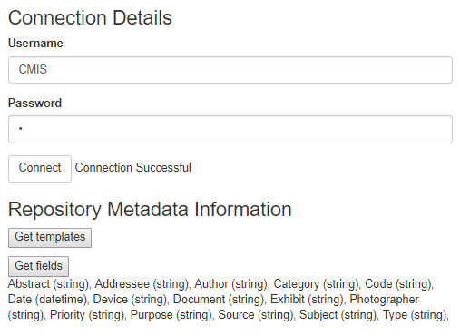

<!--© 2026 Laserfiche.
See LICENSE-DOCUMENTATION and LICENSE-CODE in the project root for license information.-->

# Getting a Repository's Templates and Fields

Using the [browser binding](../../the-browser-binding/), you can write web applications that can interact with different CMIS-compatible content management systems. In this sample application, we show how you can obtain lists of a repository's templates and fields with some simple Javascript and HTML.

In a Laserfiche repository, individual templates are child types of the CMIS secondary type` lf:template`. Fields, on the other hand, ar e defined properties of the CMIS secondary type `lf:fields`. To obtain templates, we use the selector `typeChildren` to get an array of the child types of `lf:template`. To obtain fields, we use the selector `typeDefinition` to obtain the property definitions of `lf:fields`.

Continue reading for explanations of the key parts of the code. For the full code sample, see **cmis\_get-types.html** and **cmis\_get-types.js**.

## Signing In

Our code for signing in to the repository mirrors that of our other code samples. The service URL and repository ID are specified in the sample Javascript code. Once you have signed in, a "Connection Successful" status message is displayed.

The HTML code for signing in:

```
<div id="login" class="col-md-9" role="main">

<h3>Connection Details</h3>
	
  <div class="form-group">
	<label for="username">Username</label>
	<input class="form-control" id='username' value='CMIS' required='required' />
  </div>
  <div class="form-group">
	<label for="password">Password</label>
	<input class="form-control" id='password' type="password" value='c' required='required' />
  </div>
  <button class="btn btn-default" id='connect' >Connect</button>
  <span id='connectionStatus' />
</div>
```

The Javascript code for what happens when the page is fully loaded:

```
$(document).ready(function() {
baseUrl = "http://yourServer.com/lfcmis/browser/"; //replace with your own service URL
repoUrl = baseUrl + "0"; //replace with your own repository ID

//When "Connect' button is clicked, we authenticate to the repository.
$('#connect').click( function() {
	var username = $('#username').val()
	var password = $('#password').val()
	
	$.ajaxSetup( {
		dataType: 'json',
		username: username,
		password: password,
		xhrFields: { withCredentials:true } /* Ensures cookies are passed to the server. */
	})	
	$.ajax(baseUrl, {
		success:  	$('#connectionStatus').text('Connection Successful')
	})
})		

//When "Get templates" button is clicked, get list of all templates in repository
    	$('#getTemplates').click(function() {
	$.ajax(baseUrl, {
		success:  getChildren('lf:template')
	})
});

//When "Get fields" button is clicked, get list of all fields in repository.
$('#getFields').click(function() {
	$.ajax(baseUrl, {
		success: getTypeDef('lf:fields')
	})
});
});
```

## Getting Templates

The previous code sample includes a function that is invoked when the "Get templates" button is clicked. This action invokes the `getChildren` function, passing in the parent type `lf:template` as the argument. As its name suggests, `getChildren` obtains a list of children of the parent type. We first define the CMIS selector and type ID for the AJAX request, then perform the request:

```
//Get children of lf:template. These are the individual templates.
function getChildren(parent) {
    trace("getting children of: " + parent);
    var params = {
        cmisselector: "typeChildren",
        typeId: parent
    };
    //AJAX request
    performRequest(repoUrl,  params, "GET", printTemplates, false);
}
```

```
function performRequest(url, params, method, cbFct, jsonp) {	
    $.ajax( { 
        url: url,
        data: params,
        dataType: (jsonp ? "jsonp" : "json"),
        type:  method,
        success: cbFct
    });
}
```

The callback function passed into the AJAX request is `printTemplates`, which parses the JSON response obtained from `performRequest`, extracts the IDs of the child types, and displays them at the bottom of the page:

```
//Prints child types (templates) using JSON response to getChildren.
function printTemplates(data) {
var text = '';

//Iterate through array of types in JSON response, printing the values of the type ids.
       //typeProps is a bunch of key:value pairs describing the secondary type
$.each(data.types, function(index, typeProps) { 
	text += typeProps.id;
	text += ", ";
});

$('#results').text(text);
}
```

In the HTML, the section to display the results goes below the "Get templates" and "Get fields" buttons:

```
<div id='parentType' class="col-md-9" role="main">
 <h3>Repository Metadata Information</h3>
<button id="getTemplates">Get templates</button>  <br/>
<p></p>
<button id="getFields">Get fields</button>  <br/>
<span id='results' />
</div>
```

As we will see, if you click the "Get fields" button instead, the results will be shown in the same section, overwriting any previous results displayed.

## Getting Fields

When the "Get fields" button is clicked, the `getTypeDef` function is invoked with the argument "lf:fields". Since we are looking for property definitions of the `lf:fields` type (rather than subtypes, as in the `lf:template` case), we use the CMIS selector `typeDefinition` and the type ID `lf:fields`. We then make an AJAX request, using the callback function `printFields` to process the response.

```
function getTypeDef(secType) {
trace("Getting type definition of " + secType);
var params = {
	cmisselector: 'typeDefinition', 
	typeId: secType
};

performRequest(repoUrl, params, "GET", printFields, false);
}
```

For the case of fields, we choose to print not just the name of the field, but the type of values it can take on (e.g. string). The results are then displayed in the same results section that the results for a "Get templates" request would be displayed.

```
//Prints fields and the types of values they hold, using JSON response to getTypeDef.
function printFields(data) {
var text = '';
$.each(data.propertyDefinitions, function(key, value) {
	text += value.localName;
	text += " (";
	text += value.propertyType;
	text += "), ";
})
$('#results').text(text);
}
```

The following screenshot shows what a successful request for a repository's fields might look like:

            
