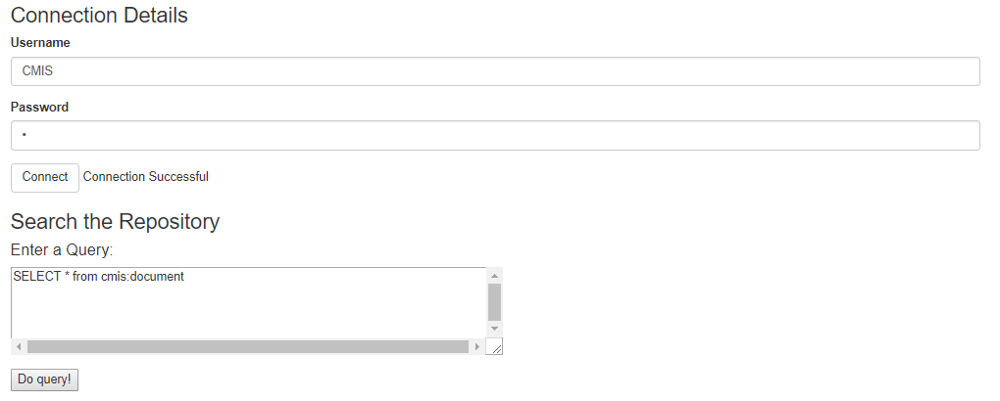
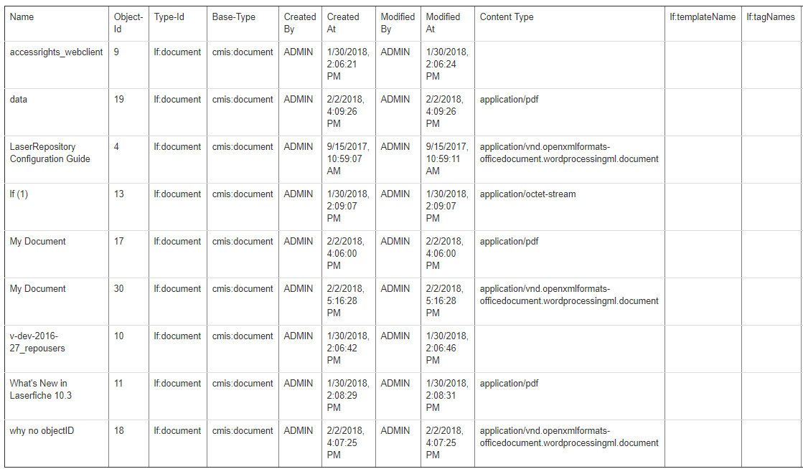

<!--© 2026 Laserfiche.
See LICENSE-DOCUMENTATION and LICENSE-CODE in the project root for license information.-->

# Querying a Laserfiche Repository

The CMIS specification contains a [query language](http://docs.oasis-open.org/cmis/CMIS/v1.1/errata01/os/CMIS-v1.1-errata01-os-complete.html#x1-10500014) very similar to SQL, which allows you to search a repository by various criteria. We use the [browser binding](../../the-browser-binding/) and jQuery to write a web application that queries a repository and displays the results in a table. 

For the full sample code, see the included **cmis\_query.html** and **cmis\_query.js**.

## Connecting

The top section of the page allows you to sign in to the repository before making the query. When the page has been fully loaded and the user clicks "Connect", their username and password are used to authenticate to the repository. If this action is successful, a status message "Connection Successful" is displayed on the page. If you reuse this code, you should change `baseURL` and `repoUrl` in the JavaScript code to match your configuration.

```
$(document).ready(function() {
baseUrl = "http://yourServer.com/lfcmis/browser/";
repoUrl = baseUrl + "0/";

$('#connect').click( function() {
	var username = $('#username').val()
	var password = $('#password').val()
	
	$.ajaxSetup( {
		dataType: 'json',
		username: username,
		password: password,
		xhrFields: { withCredentials:true } /* Ensures cookies are passed to the server. */
	})	
	$.ajax(baseUrl, {
		success:  	$('#connectionStatus').text('Connection Successful')
	})
})		

    $('#doquery').click(function() {
	$.ajax(baseUrl, {
		success:  doQuery($('#queryfield').val())
	})
});
});
```

## Querying

After signing in, you can enter a query in the query box and click "Do query!", at which point the `doQuery` function will be invoked.

Before any query results are displayed, the website should look as follows. The HTML for the sign-in form and the query form is also excerpted below.

            

```
<div id="login" class="col-md-9" role="main">

<h3>Connection Details</h3>
	
  <div class="form-group">
	<label for="username">Username</label>
	<input class="form-control" id='username' value='CMIS' required='required' />
  </div>
  <div class="form-group">
	<label for="password">Password</label>
	<input class="form-control" id='password' type="password" value='c' required='required' />
  </div>
  	<button class="btn btn-default" id='connect' >Connect</button>
	<span id='connectionStatus' />
</div>
```

```
<div id='query' class="col-md-9" role="main">
<h3>Search the Repository</h3>
    	  <h4> Enter a Query: </h4>
    		<form>
  	  <fieldset>
    		<textarea id="queryfield" cols="80" rows="5">SELECT * from cmis:document
    		</textarea>
  	  </fieldset>
	</form>
	<p></p>
    		<button id="doquery">Do query!</button>  <br/>
	<p></p>
</div>
```

## Processing the Query

The `doQuery` function takes the query statement specified in the query box, puts the parameters for the query (in `params`), and sends an AJAX request (`performRequest`) containing the query in the format expected by the CMIS specification. The request is made to the repository URL. Note that of the parameters specified in our sample code, only `cmisselector` and `q` are required; the others are optional.

```
function doQuery(queryString) {
        $("#queryresponsesection").html(null);
        trace("doing query: " + queryString);
        var params = {
            cmisselector: "query",
            q: queryString,
            searchAllVersions: "false",
            includeAllowableAction: "false",
            includeRelationships: "none",
            suppressResponseCodes: "false"
        };

 performRequest(repoUrl,  params, "GET", createQueryTable, false);
}
```

```
function performRequest(url, params, method, cbFct, jsonp, username, password) {
    $.ajax( { 
        url: url,
        data: params,
        dataType: (jsonp ? "jsonp" : "json"),
        type:  method,
        success: cbFct
    });
}
```

`performRequest` calls the `createQueryTable` function. The latter gathers the properties of the query results to be displayed (using another function, `getPropIdsToDisplayForQuery`) and inserts the correct format strings for a table display. Our sample code displays only the properties specified in function `getPropIdsToDisplayForQuery` and Laserfiche's custom properties.

```
function createQueryTable(queryResp) {
var row;
var tbody;
var tbl = $('<table>').attr('id', 'queryRespTable').attr('border', 1);

var propsDisp = getPropIdsToDisplayForQuery(queryResp);
var propsToDisplay = propsDisp.ids;
var propsToDisplayLabel = propsDisp.labels;

trace("create result table from query");
tbl.append($('<thead>').append(row = $('<tr>')));
for (var propKey in propsToDisplay) {
	row.append($('<td>').text(propsToDisplayLabel[propKey]));
}

tbl.append(tbody = $('<tbody>'));
for (var child in queryResp.results) {
    trace("add row to table");
	row = null;
	tbody.append(row = $('<tr>'));
	for (var propKey in propsToDisplay) {
		var props = queryResp.results[child].properties;
		var prop = props[propsToDisplay[propKey]];
		if (null != prop && null != prop.value) {
			var text = convertValue(prop.value, prop.type);
			var cell = $('<td>').html(text.toString());
			row.append(cell);
		} else
			row.append($('<td>'));
	}
}

$("#queryresponsesection").append($('<h4>').text("Result")).append(tbl);
}
```

```
function getPropIdsToDisplayForQuery(queryResp) {
var propsToDisplay = ["cmis:name", "cmis:objectId", "cmis:objectTypeId","cmis:baseTypeId","cmis:createdBy",
		"cmis:creationDate", "cmis:lastModifiedBy", "cmis:lastModificationDate","cmis:contentStreamMimeType"];
var propsToDisplayLabel = ["Name", "Object-Id", "Type-Id", "Base-Type", "Created By", "Created At",
						   "Modified By", "Modified At", "Content Type"];
for (var child in queryResp.results) {
	for (var prop in queryResp.results[child].properties) {
		var propQueryName = queryResp.results[child].properties[prop].queryName;
		if (propQueryName.indexOf("cmis:") != 0 && $.inArray(propQueryName, propsToDisplay) < 0) {
			propsToDisplay.push(propQueryName);
			propsToDisplayLabel.push(queryResp.results[child].properties[prop].queryName);
		}
	}
}
return { ids: propsToDisplay, labels: propsToDisplayLabel};
}
```

## Displaying Results

In its final line, `createQueryTable` specifies that the results be displayed in the `queryresponsesection` part of the HTML—this is at the bottom of the page. A screenshot of some sample results follows.

            

The table is displayed in the following `div` in the HTML file:

```
<div id='queryresponsesection' class="col-md-9" role="main">
</div>   
```
