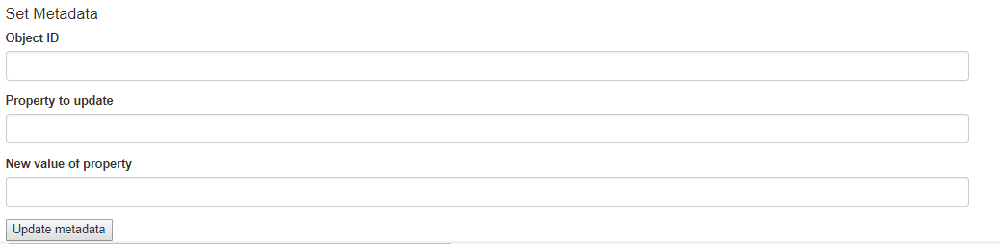

<!--© 2026 Laserfiche.
See LICENSE-DOCUMENTATION and LICENSE-CODE in the project root for license information.-->

# Setting Field Values

Using the [browser binding](../../the-browser-binding/), you can write JavaScript web applications that can interact with different CMIS-compatible content management systems. This tutorial showcases a web application that lets users set fields values or tag comments on a Laserfiche entry.

From CMIS's perspective, Laserfiche fields are properties of documents or folders. You can retrieve field values using the CMIS selector `properties`. To set field values, you can submit the new field values through a HTML form. Tag comments are the same type of object as fields, and can be retrieved or set the same way.

To build our application, we add an additional section to our sample code for [querying a repository](../querying-a-laserfiche-repository/). This additional section lets you update field values after you have queried the repository to find out what they are. You can also query the repository to check your changes after your update.  For the full sample code, see **cmis\_query-set-fields.html** and **cmis\_query-set-fields.js**.

## Syntax for Form Fields

The "Set Metadata" part of the form contains three fields that the user should fill in:

- The Object ID is the ID of the Laserfiche entry whose metadata the user wants to update.
- The "Property to update" field should be filled in as follows:
    - For a field, use the format "field:*fieldname*".
    - For a tag comment, use the format "tagComment:*tagname*".
    - **Example:** To set the value for the field named "Date", enter "field:Date" under "Property to update". To set a value for the "Important" tag, enter "tagComment:Important" under "Property to update".

The part of the form for entering the new metadata looks as follows:

            

## Overview of Code

 The service URL the application will use is set in the JavaScript code, and assumes a repository ID of "0".

Similarly to the case of [uploading files to a repository](../uploading-files/), the data we pass to the repository for an update is passed in the form of a `propertyId` array and a `propertyValue` array. In our code, we only pass one field value at a time, so our arrays have only one element each:

- `propertyId[0]` is the field that needs updating, or the tag whose comment needs updating.
- `propertyValue[0]` is the new value of the field or tag comment.

These arrays are submitted to the CMIS server using a HTTP POST request. Included is a hidden input identifying the `cmisaction` as `update`, and another hidden input that passes a random number identifying the transaction under the name `token`. When the form is submitted, we invoke a JavaScript function, `updateObjUrl`, that tells the rest of our JavaScript what the object URL is, based on the object ID specified in the form.

```
<h4>Set Metadata</h4>
<form id='updateMetadata' action="" target="createresultframe" enctype="multipart/form-data" onsubmit="updateObjUrl()" method="post">
	<div class="form-group">
		<label for="objectID">Object ID</label>
		<input class="form-control" name='objectId' id='objectId' required='required' />
	</div>
	<div class="form-group">
		<label for="property">Property to update</label>
		<input class="form-control" name="propertyId[0]" id='property' required='required' />
	</div>
	<div class="form-group">
		<label for="newValue">New value of property</label>
		<input class="form-control" name="propertyValue[0]" id='newValue' />
	</div>
	<input id="updateProp" type="submit" value="Update metadata" />
			
	<input name="cmisaction" type="hidden" value="update" />
	<input id="transactionId" name="token" type="hidden" value="" />  <!-- see CMIS spec 5.4.4.4  -->  
</form>
<span id='updateMetadataStatus' />
```

The code to update the object URL:

```
function updateObjUrl() {
var rootUrl = repoUrl + "root";
objId = $("#objectId").val();
trace("object ID: " + objId);
objUrl = rootUrl + "?objectId=" + objId;
trace("object url: " + objUrl);
$("#updateMetadata").attr("action", objUrl);
init = true;
trace("update entry with Id: " + objId + " at " + $("#updateMetadata").attr("action"));
$("#transactionId").val(createRandomString());
return true;
}
```

## Retrieving the Response

The practice for retrieving the CMIS server's response to the form submission follows that used in our code sample for [uploading files](../uploading-files/). We have an invisible IFrame that receives the JSON response from the server—the HTML form's `target` is set to this frame. When the invisible IFrame loads, a JavaScript function (`updateMetadataDone`) that processes the JSON response is called. The HTML for the invisible IFrame is as follows:

```
<iframe id="createresultframe" name="createresultframe" style="width:0px;height:0px;visibility:hidden" onload="updateMetadataDone()">
</iframe>
```

The function `updateMetadataDone` retrieves the transaction ID as specified in the form, then calls a function, `getObjectFromTransaction`. The latter contains a callback function that parses the JSON response and displays a success message or error message depending on the HTTP status code in the response.

```

function updateMetadataDone() {
       if (init == null || !init)
    return;

var transId = $("#transactionId").val();
trace("Updating metadata in transaction: " + transId);
    	getObjectFromTransaction(transId, function(data) {
	var jsonobj = $.parseJSON(data);
	//display success message or error code and message
	if (jsonobj.code<300 && jsonobj.code>199) {
		var text = " Metadata successfully updated for object: " + jsonobj.objectId + " and transaction id: " + transId;
		$("#formResponseSection").html(text);
	}
	else {
		var text = "Error " + jsonobj.code + ": " + jsonobj.message;
		$("#formResponseSection").html(text);
	}
    });	
}

function getObjectFromTransaction(transId, cbFct) {
    var params = {
        cmisselector: "lastResult",
        token: transId,
        suppressResponseCodes: false
    };

performRequest(repoUrl, params, "GET", cbFct, "json")

    trace("getObjectFromTransaction(): " + repoUrl  + ", transaction-id: " + transId);
}
```

```

function performRequest(url, params, method, cbFct, jsonp) {
    $.ajax( { 
        url: url,
        data: params,
        dataType: (jsonp ? "jsonp" : "json"),
        type:  method,
        success: cbFct
    });
}
```

### Related Topics

- [Assigning Templates and Tags with a CMIS Web Application](../assigning-templates-and-tags/)
