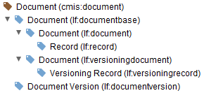
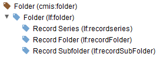
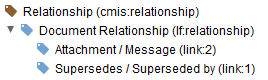
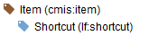
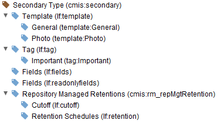

<!--© 2026 Laserfiche.
See LICENSE-DOCUMENTATION and LICENSE-CODE in the project root for license information.-->

# Services and Object-Types

The CMIS service consists of a number of subservices, which are essentially actions to manipulate objects in the repository or to retrieve information from the repository. Laserfiche supports many of the most important subservices. CMIS also specifies a set of primary base object-types. Laserfiche supports all of them except the [policy](http://docs.oasis-open.org/cmis/CMIS/v1.1/errata01/os/CMIS-v1.1-errata01-os-complete.html#x1-610007) object-type.

CMIS defines [secondary object-types](http://docs.oasis-open.org/cmis/CMIS/v1.1/errata01/os/CMIS-v1.1-errata01-os-complete.html#x1-690009), which are also supported by Laserfiche. A secondary type is a set of properties that can be added to or removed from objects that are not defined by its primary type. An object can have multiple secondary types at the same time. In Laserfiche, templates and tags are represented by secondary object-types in CMIS.

The Laserfiche CMIS Gateway supports searching using the query language specified by CMIS. Here we detail the object-types and the Laserfiche CMIS Gateway-supported services associated with them. Each object-type has the CMIS-defined properties required of its parent CMIS object type. For Laserfiche-specific properties, see [Laserfiche Object Properties in CMIS](../laserfiche-object-properties-in-cmis/).

### Document Object-Type

The document object-type in CMIS corresponds to a document or record in Laserfiche. Laserfiche supports the following services on document object-types:

- Returning properties, relationships, access control lists, versions, and types.
- Rendering documents.
- Updating properties and access control lists.
- Updating properties of document versions and downloading contents of document versions.
- Creating a document in the default logical volume and assigning metadata to it.
- Deleting, moving, and copying the document.
- Updating and assigning record management properties.

The hierarchy of document object-types is as follows: subtypes are nested under their parent types, and the parentheses contain the IDs of the object-types.

            

### Folder Object-Type

The folder object-type corresponds to Laserfiche folders, record folders, and record series. The following services on this object-type are supported:

- Returning folder properties, access control lists (ACLs), and type
- Deleting the folder or the folder and its descendants
- Moving the folder
- Updating the folder's properties and ACLs
- Creating a folder (in the default logical volume) and assigning metadata to it.
- Updating record management properties.

The hierarchy of folder object-types is as follows: subtypes are nested under their parent types, and the parentheses contain the IDs of the object-types.

            

### Relationship Object-Type

This object-type corresponds to Laserfiche's [Document Relationships](https://www.laserfiche.com/support/webhelp/Laserfiche/10/en-us/userguide/Default.htm#../Subsystems/client_wa/Content/Metadata/Document_Relationships.htm?Highlight=relationship) metadata feature. The following services on relationships are supported:

- Returning properties and type of relationship
- Deleting relationships
- Updating properties, including bulk updating (updating the properties of more than one object at once).

The hierarchy of relationship object-types is as follows: subtypes are nested under their parent types, and the parentheses contain the IDs of the object-types.

            

### Item Object-Type

This represents shortcuts to entries in Laserfiche's system. The following services on shortcuts are supported:

- Returning shortcut properties, ACL, and type
- Deleting and moving the shortcut
- Updating the shortcut's properties
- Changing the shortcut's ACL

The hierarchy of item object-types is as follows: subtypes are nested under their parent types, and the parentheses contain the IDs of the object-types.

            

### Policy Object-Type

This object-type is not supported by Laserfiche.

### Secondary Object-Type

This object-type represents fields, templates, tags, cutoffs (for records management) and retention schedules (for records management). The following services on these objects are supported:

- Adding, updating, and deleting.

The hierarchy of secondary object-types is as follows: subtypes are nested under their parent types, and the parentheses contain the IDs of the object-types.

            

## Supported Services

See the pages describing the services for individual bindings for a list of supported services and their Laserfiche extensions.

- [AtomPub binding services](../atom-binding-services/)
- [Services for browser binding and web services binding](../browser-binding-and-web-services-binding-services/)

## Unsupported Services

Since the policy object-type is not supported by the Laserfiche CMIS Gateway, the Gateway also does not support any of the policy-related services, like [createPolicy](http://docs.oasis-open.org/cmis/CMIS/v1.1/os/CMIS-v1.1-os.html#x1-2410005), [applyPolicy](http://docs.oasis-open.org/cmis/CMIS/v1.1/os/CMIS-v1.1-os.html#x1-3540001), [getAppliedPolicies](http://docs.oasis-open.org/cmis/CMIS/v1.1/os/CMIS-v1.1-os.html#x1-3620003), or [removePolicy](http://docs.oasis-open.org/cmis/CMIS/v1.1/os/CMIS-v1.1-os.html#x1-3580002). It also does not support the following services:

- Services related to checking in or checking out, such as [checkIn](http://docs.oasis-open.org/cmis/CMIS/v1.1/os/CMIS-v1.1-os.html#x1-3320003), [checkOut](http://docs.oasis-open.org/cmis/CMIS/v1.1/os/CMIS-v1.1-os.html#x1-3240001), [cancelCheckOut](http://docs.oasis-open.org/cmis/CMIS/v1.1/os/CMIS-v1.1-os.html#x1-3280002), or [getCheckedOutDocs](http://docs.oasis-open.org/cmis/CMIS/v1.1/os/CMIS-v1.1-os.html#x1-2200006).
- Multifiling (filing documents so that they have multiple parent objects) or non-filing (moving an object from a folder without putting it under another folder). These include the services [removeObjectFromFolder](http://docs.oasis-open.org/cmis/CMIS/v1.1/os/CMIS-v1.1-os.html#x1-3100002) and [addObjectToFolder](http://docs.oasis-open.org/cmis/CMIS/v1.1/os/CMIS-v1.1-os.html#x1-3060001).
- Changing types. [createType](http://docs.oasis-open.org/cmis/CMIS/v1.1/os/CMIS-v1.1-os.html#x1-1870006), [updateType](http://docs.oasis-open.org/cmis/CMIS/v1.1/os/CMIS-v1.1-os.html#x1-1910007), and [deleteType](http://docs.oasis-open.org/cmis/CMIS/v1.1/os/CMIS-v1.1-os.html#x1-1950008) are not supported.
- The following navigation-related services are not supported: [getDescendants](http://docs.oasis-open.org/cmis/CMIS/v1.1/os/CMIS-v1.1-os.html#x1-2040002) and [getFolderTree](http://docs.oasis-open.org/cmis/CMIS/v1.1/os/CMIS-v1.1-os.html#x1-2080003).
- Other unsupported services: [getContentChanges](http://docs.oasis-open.org/cmis/CMIS/v1.1/os/CMIS-v1.1-os.html#x1-3190002) and [appendContentStream](http://docs.oasis-open.org/cmis/CMIS/v1.1/os/CMIS-v1.1-os.html#x1-29700019).
