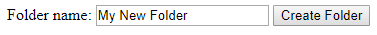

<!--© 2026 Laserfiche.
See LICENSE-DOCUMENTATION and LICENSE-CODE in the project root for license information.-->

# Laserfiche CMIS Gateway Browser Binding

The browser binding was introduced in CMIS 1.1. It allows for a wider range of actions than the AtomPub binding and is easy to use with simple JavaScript and HTML. Key features of the browser binding:

- The `GET` verb is used to read data from repositories.
- `POST` is used to create, modify, and remove repository data.
- CMIS repositories can provide responses in JSON format or as binary contents, if document data are requested.

In the [Laserfiche CMIS Gateway browser binding specification](../browser-binding-and-web-services-binding-services/) documentation, a `GET` request is referred to as a query, while a `POST` request is referred to as a form, because the request body uses HTML  form data encoding. While access from client-side JavaScript is a primary use-case, the Browser binding is now the recommended CMIS binding for all new applications, including server-side and desktop applications.

## Submitting Form Data

HTML form data can be sent to a CMIS server in either `application/x-www-form-urlencoded` or `multipart/form-data` format. If you are uploading documents, then you need to use a multipart message to transmit the binary content. The parameter `cmisaction` must always be included in a `POST` action. It determines which operation is to be carried out. For example, you would set `cmisaction` to `delete` in order to delete an object in a repository.

In the following example, we create a HTML form that lets the user create a folder on the Laserfiche server *myserver*, in the root folder of a repository with ID *repositoryID*. We pass in `createFolder` for our `cmisaction` input name. In the dialog box for the name of the new folder, the user can change the default new folder name specified in the code, which is "My New Folder". When the user clicks the "Create Folder" button, a new folder with the specified name is created.

```
<html>
<body>
<form name="createFolderForm"
action="http://myserver/lfcmis/browser/repositoryID/root"
method="post" enctype="multipart/form-data">
  <input name="cmisaction" type="hidden" value="createFolder" />
  <input name="propertyId[0]" type="hidden" value="cmis:name" />
  Folder name: <input name="propertyValue[0]" type="text"
value="My New Folder" />
  <input name="propertyId[1]" type="hidden"
value="cmis:objectTypeId" />
  <input name="propertyValue[1]" type="hidden"
value="cmis:folder"></td>
  <input name="propertyId[2]" type="hidden" value="lf:autoRename" />
  <input name="propertyValue[2]" type="hidden" value="false" />
  <input type="submit" value="Create Folder" />
</form>
</body>
</html>
```

This bare-bones form is rendered in a browser as follows:

            

You will notice that the three properties we are passing to the server are encoded in six parameters:

- `propertyId[0]` and `propertyValue[0]` represent the new folder's name
- `propertyId[1] `and` propertyValue[1]` represent the type of the new object
- `propertyId[2]` and `propertyValue[2]` contain the value of the `lf:autoRename` parameter.

Generally, the browser binding requires that you pass a pair of parameters to set a single-value property: One parameter for the name of the property, and another for the value of the property. We have set the value of `lf:autoRename` to `false` above, which means that Laserfiche will not automatically rename the new folder if a folder with that name already exists. 

For more code samples, see [Building a CMIS Web Application](../building-a-cmis-web-application/).

## Key URLs

If your Laserfiche server is named *myserver* and the repository you want to access has ID *repositoryID*, then:

- Your service URL is `http://myserver/lfcmis/browser/`.
- Your repository URL is `http://myserver/lfcmis/browser/repositoryID`.
- Your root folder is at` http://myserver/lfcmis/browser/repositoryID/root`.

## URL Structure

Queries, as opposed to forms, simply retrieve data from the Laserfiche Server through a URL, using the HTTP `GET` method. One of the advantages of the browser binding over the AtomPub binding is the existence of a fixed URL syntax in the former. The particular data that is returned by a read operation is determined by the query parameter `cmisselector`. If you do not specify `cmisselector` in the request, CMIS requires that servers determine the type of data returned according to the base type of the object you are trying to read. Here are some common URL formats that will help you access key repository functions:

- `http://myserver/lfcmis/browser/repositoryID/root?objectID=12345` is the URL for an the object with ID 12345. If the object has a content stream, entering this URL in your browser will cause your browser to download the content stream.
- `http://myserver/lfcmis/browser/repositoryID/root/myfolder/doc.txt` is the URl for the file named "doc.txt" that is located in a child folder "myfolder" within the root directory.
- `http://myserver/lfcmis/browser/repositoryID/root?objectID=12345&cmisselector=versions` gives you the versions of the object with ID 12345. The `cmisselector` parameter lets you specify which aspects of an object to query.

While you can simply enter the URL in your browser, the response returned by the server will be in a JSON format. Use JavaScript to parse the JSON response into a more readable format.

## JavaScript

The sample HTML form presented earlier is a simple example that does not even tell you if you have successfully created a folder—all it does is submit the request to create one. For most applications using the browser binding, you will want to include JavaScript code that will process the response from the Laserfiche CMIS Gateway and display a messageto notify you when a folder is successfully created, or when the create folder action fails. Similarly, if you were retrieving information from the Laserfiche Server about the files in a certain folder, you would want to use JavaScript to parse the JSON response that contains that information. To simplify the JavaScript, you can use any number of open source CMIS client libraries for JavaScript, or more general-purpose JavaScript libraries like jQuery.

## Exceptions

The browser binding uses the same HTTP status codes as the AtomPub binding. However, unlike the latter, the browser binding includes in error responses a JSON response body with the exception type and a message about what happened.

## Browser Binding Services

The Laserfiche CMIS Gateway follows the CMIS standard for most of the major services, but also includes numerous extensions. Navigate to the [browser binding services](../browser-binding-and-web-services-binding-services/) section for a full list of the services and extensions supported by the Laserfiche CMIS Gateway.
