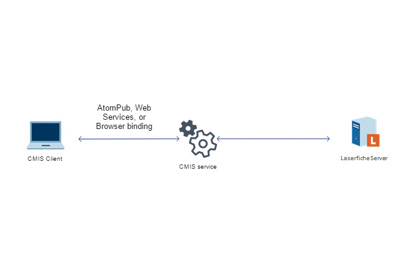

<!--© 2026 Laserfiche.
See LICENSE-DOCUMENTATION and LICENSE-CODE in the project root for license information.-->

# The Laserfiche CMIS Gateway

Content Management Interoperability Services (CMIS) is a standardized protocol for accessing enterprise content management (ECM) systems. The Laserfiche CMIS Gateway adds support for the CMIS protocol to Laserfiche, which means you can write custom applications that use the same protocol to connect to Laserfiche repositories and other CMIS-compliant repositories. The latest version of the CMIS standard specifies a web API that can be used in a wide range of platforms and programming languages to connect to Laserfiche repositories. While there are a variety of free and open-source CMIS client libraries in various programming languages, a pre-written library is not required to connect to a CMIS-compliant system such as Laserfiche, because CMIS is an open standard and common services are relatively simple to invoke using a web development stack using generic platform APIs.

## Standards, Client Libraries, and Clients

The CMIS standard was developed and is published by the Organization for the Advancement of Structured Information Standards (OASIS), a vendor-neutral consortium that publishes open standards for enterprise technologies. The full specification for CMIS 1.1 can be found on the [OASIS website](http://docs.oasis-open.org/cmis/CMIS/v1.1/os/CMIS-v1.1-os.html), which may be a useful resource for developers looking to write advanced CMIS integrations. The CMIS standard defines a set of content management services that CMIS-compliant servers should implement, along with so-called bindings that specify how these services map to network application protocols. The interface defined by the CMIS "Browser binding" builds on common web technologies, such as HTTP and JSON, and is the recommended CMIS binding for new applications due to its relative ease of use and efficiency.

            

There are free and open-source pre-built libraries and tools for a variety of programming languages that ease the task of building applications that communicate with CMIS-compliant repositories. This documentation links to some open source projects that are known to work with Laserfiche, but the links are not intended to be an exhaustive list, nor a promise that all functionality of either the third-party code or Laserfiche will interoperate perfectly. Because the CMIS Browser binding is based on open web technologies, purpose-built libraries and tools are not required to quickly build applications that connect to Laserfiche using the CMIS protocol. Nevertheless, existing tools and libraries can be very helpful when writing applications that use CMIS. For example, the [CMIS Workbench](http://chemistry.apache.org/java/developing/tools/dev-tools-workbench.html) program is a CMIS client, built on the Java-based OpenCMIS Client Libraries, that works with Laserfiche and can be used to explore repository objects and their properties as exposed by Laserfiche's CMIS implementation.

In the following sample code, we use the open-source Python [cmislib](http://chemistry.apache.org/python/docs/about.html) client library, which is part of the [Apache Chemistry](http://chemistry.apache.org/) project, to manipulate repository objects. We assume that the Laserfiche server name is *myserver*, and that you can sign in with the credentials *myUsername* and *myPassword*. We then get the default repository, find its root folder, create a folder there, and create a text document in the new folder. We confirm the contents of the new folder by getting a list of its children and printing it to the console.

```
from cmislib.model import CmisClient, Repository
client = CmisClient('http://myserver/lfcmis/atom', 'myUsername', 'myPassword')
repo = Client.getDefaultRepository()
root = repo.getRootFolder()
newFolder = root.createFolder('NewFolder')
newFile = open('emptydoc.txt', 'r')
newDoc = newFolder.createDocument('New Document', contentFile=newFile)
children = newFolder.getChildren()
for child in children:
    print child.name
```

We include more extended code samples that use JavaScript code and the browser binding to access the repository and manipulate objects in it. See [Building a CMIS Web Application](../building-a-cmis-web-application/) for more information.

## Bindings

The CMIS protocol tells you how to request certain services from a repository. Services include actions like creating a folder, and queries like searching a repository. Bindings are mappings from services to protocols, effectively realizing the services over an application-layer protocol. Your choice of binding influences how you build your CMIS client—a CMIS client library may only work with some bindings and not others. Version 1.1 of the CMIS specification defines three different sets of bindings: [AtomPub](../the-atompub-binding/), [web services](../the-web-services-binding/), and [browser](../the-browser-binding/) bindings. The Laserfiche CMIS Gateway supports all three bindings. In the sample code presented earlier, by not specifying a binding in the `CmisClient` function, we defaulted to using the AtomPub binding, as that is the default binding for that library. If we had wanted to use the browser binding, we would have imported the `BrowserBinding` library and added the `binding` parameter to the `CmisClient` function:

```
from cmislib.browser.binding import BrowserBinding
client = CmisClient('http://myserver/lfcmis/browser', 'myUsername', 'myPassword', binding=BrowserBinding())
```

Similarly to `cmislib`, many other client libraries also make it easy to use different bindings without having to change method or class names. The main differences between the bindings lies in their performance, the number of services they cover, and the applications they support.

The browser binding is particularly useful for web applications. By simply including the appropriate JavaScript on a HTML page, you can create a web interface for users to interact with a repository. Since nearly every web browser that is included by default on modern devices supports JavaScript, you can essentially create a platform-independent interface for interacting with a Laserfiche repository. The browser binding produces JSON files as responses to a client request, and accepts HTML forms as requests from the user. The CMIS standard specifies the form that these responses and requests must take. The Browser binding uses only the `GET` and `POST` HTTP methods, and covers the entire CMIS specification—every service in the specification is supported by the Browser binding.

The AtomPub binding is modeled on REST principles, and adheres to the AtomPub specification. Any AtomPub client can interact with a CMIS repository. If you use the AtomPub binding, responses from the server to the client are provided in the form of XML documents. The CMIS standard defines the schema of these XML request and response bodies. The AtomPub binding uses the `GET`, `POST`, `PUT`, and `DELETE` HTTP methods. The AtomPub binding covers most of the CMIS specification, but does not support some services, [createDocumentFromSource](http://docs.oasis-open.org/cmis/CMIS/v1.1/os/CMIS-v1.1-os.html#x1-2290002) being one prominent example.

The web services binding uses the Simple Object Access Protocol (SOAP). Like the AtomPub binding, messages are sent in the form of XML documents. Like the browser binding, the web services binding covers the entire CMIS specification.

The browser binding is more suitable than the AtomPub and web services bindings in low-bandwidth situations, as the JSON responses of the browser binding are more compact than the XML responses of the AtomPub and web services bindings. Parsing the AtomPub's XML responses is also more difficult for some web browsers. In addition, the browser binding has a fixed URL syntax for accessing objects in the repository—a CMIS client can always use the same form of URL even if it is accessing different types of repositories. In the AtomPub binding, you may have to step through several HTTP requests before retrieving the object you want, as the URLs you need are returned in XML responses that are obtained by stepping through a hierarchy. This is another source of slowness in the AtomPub binding.

## Extensions

Extensions are a way for a content management system, such as Laserfiche, to expose additional features not addressed directly by the CMIS specification. CMIS clients that are not customized to make use of extensions will simply ignore them, while clients that can interpret the extensions will use them. The Laserfiche CMIS Gateway contains a number of extensions to support Laserfiche-specific concepts and functionality. In the documentation for each binding, we list any Laserfiche-specific extensions that exist.

## Resources

The open-source Apache Chemistry project offers a number of CMIS client libraries. Consult [their website](https://chemistry.apache.org/) to see which bindings each library supports and to download the libraries.
