<!--© 2026 Laserfiche.
See LICENSE-DOCUMENTATION and LICENSE-CODE in the project root for license information.-->

# Advanced LFQL Grammar

LFQL grammar is very similar to SQL grammar. In the section on [search syntax examples](../../searching-repositories/search-syntax/examples-in-advanced-search-syntax-and-lfql/), we provide some examples of searches with LFQL, which will give you an intuitive picture of the underlying grammar. If you want a more formal, complete introduction to the details of LFQL grammar, read on.

Here we present ordinary-language descriptions of the grammar in conjunction with railroad diagrams and formal statements in Backus-Naur form. If you are merely looking for a formal summary, you can simply focus on the Backus-Naur statements. Each railroad diagram is a precise representation of the Backus-Naur statement that it is paired with. The railroad diagram should be read following the path of the lines, going from left to right. Alternative paths to get from left to right represent alternative ways of forming a grammatical query. The ►►─── symbol indicates the beginning of the diagram, and the ───►◄ symbol indicates the end of the diagram.

The railroad tracks may allow for the repetition of certain elements, or for a choice between different paths that have the same starting and ending points. Both these cases appear as loop-like structures, but in the former case, the tracks diverge and converge in a way that allows a "train" to travel in a loop indefinitely, while in the latter, a "train" that chose one path over another cannot turn back onto the other path. Visually, a repetition loop looks like this:

            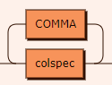

You can easily imagine a train coming from the left, taking a "left turn" after `colspec`, then picking up another `COMMA` and another `colspec`, and so on indefinitely. In contrast, an option to take a different path without repetition looks like this:

            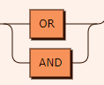

Here, a train at the start of the diagram (the top leftmost corner) would have to choose either the `OR` or the `AND` path. Once it comes back out of the other side, the way the tracks converge make it impossible for the train to "turn around" onto the path that it had avoided. Instead, the train has no choice but to go on "ahead" (towards the right edge of the diagram).

In Backus-Naur statements, a question mark `?` at the end of a term or statement indicates that that term or statement is optional, while `*` indicates an option to repeat a phrase within a clause indefinitely. For example, it is optional to use an `AS` when specifying an alias, and you can specify as many tables as you want in a `FROM clause`.

## stmt: Main Statement

Every query takes the form of this statement. `colspec` represents the column that we are selecting to output as results, and forms part of the mandatory `SELECT `clause. `fclause_opt` represents the optional `FROM` clause that specifies the tables that we are selecting from. `wclause` is the `WHERE` clause, which specifies the conditions that the rows in the result set must meet. `oclause_opt` is the optional `ORDER BY` clause, used if we want to sort our results. We describe what each of these clauses does, briefly, in our [introduction to constructing a LFQL query](../constructing-a-laserfiche-query-language-command/).

            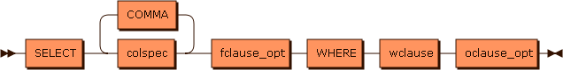

```
stmt     ::= SELECT colspec ( COMMA colspec )* fclause_opt WHERE wclause oclause_opt
```

`stmt` is not referenced by anything.

You will notice the loop that `COMMA` is in. A loop like this means that multiple colspecs, separated by `COMMA`s, can be specified, depending on how many times we go counter-clockwise around the loop. For example, `SELECT` → `colspec` → `COMMA` → `colspec` → `COMMA `→ `colspec` →` fclause_opt` → `WHERE` → `wclause` → `oclause_opt` would be a possible path, as shown in queries like [this](../../searching-repositories/search-syntax/examples-in-advanced-search-syntax-and-lfql/#threeColQuery).

## colspec: SELECT Statement

As indicated above, we can specify as many columns as we want as long as there is a comma between any two columns. In addition, we can specify an `AS` option within the column specification. This lets us [assign aliases (or correlation names) to the columns](../constructing-a-laserfiche-query-language-command/#Table). Aliases make it easier for us to refer to the columns in later clauses, if we want to filter the results by a function on the columns. The alias you assign must satisfy certain rules---see the rules for identifiers on what can count as an `IDENT`. The question mark at the end of the statement indicates that this clause is optional.

            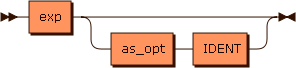

```
colspec  ::= exp ( as_opt IDENT )?
```

Referenced by: `stmt`

## fclause\_opt: FROM Statement

The `FROM` clause allows us to specify the tables from which we are obtaining our results. As with specifying columns, the diagram shows that we can specify as many tables as we want, as long as each table (represented by `fromspec`) is separated from the next table by a `COMMA`. Specifying no tables is an option. This option is represented by the bottommost path, which is empty. The `LF.Entry` table will be queried if no tables are specified.

            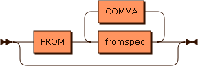

```
fclause_opt
         ::= ( FROM fromspec ( COMMA fromspec )* )?
```

Referenced by: `stmt`

### fromspec: Tables Specified

If we choose not to assign correlation names (aliases) to tables, we can take the top railroad track of this diagram, which is empty. The bottom track gives us the option to assign aliases to tables, the same way we can assign aliases to columns. These aliases can then be used in other clauses to filter the results. The left `IDENT` is the table's original name, and the right `IDENT` is your chosen alias for the table. See the rules for identifiers on what can count as an `IDENT`.

            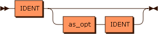

```
fromspec ::= IDENT ( as_opt IDENT )?
```

Referenced by: `fclause_opt`

## as\_opt: Aliases or Correlation Names

The empty top railroad track indicates that this option can be skipped: you do not have to include an `AS` before your alias. In our list of sample queries, we include [samples that use `AS`](../../searching-repositories/search-syntax/examples-in-advanced-search-syntax-and-lfql/#tagcommentsearch), and [samples that do not](../../searching-repositories/search-syntax/examples-in-advanced-search-syntax-and-lfql/#classifiedtagsearch).

            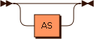

```
as_opt   ::= AS?
```

Referenced by: `colspec`, `fromspec`

## wclause: The WHERE clause

This is the most complicated clause, as it allows us to specify conditions that the returned results must satisfy. These conditions can be based on propositional logic, pattern-matching of strings, a full-text search, or comparing ordered quantities (numbers, dates, and times). Conditions of different types can be combined using the propositional logic operators.

            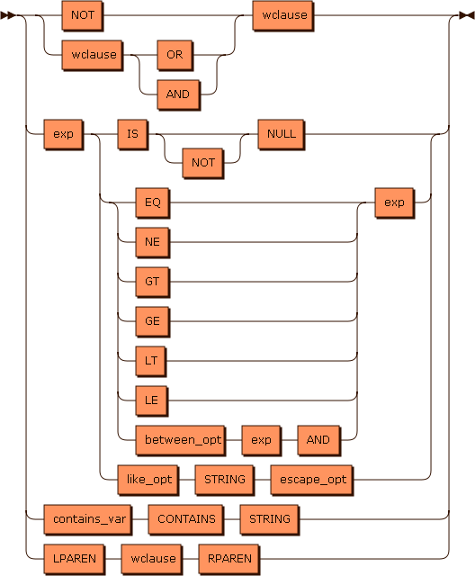

```
wclause  ::= ( NOT | wclause ( OR | AND ) ) wclause
           | exp ( IS NOT? NULL | ( EQ | NE | GT | GE | LT | LE | between_opt exp AND ) exp | like_opt STRING escape_opt )
           | contains_var CONTAINS STRING
           | LPAREN wclause RPAREN
```

Referenced by: `stmt`, `wclause`

### like\_opt: Pattern-Matching by Similarity

This clause lets you obtain results containing string patterns. In the section containing search query samples, we include a [couple](../../searching-repositories/search-syntax/examples-in-advanced-search-syntax-and-lfql/#tagcommentsearch) of [queries](../../searching-repositories/search-syntax/examples-in-advanced-search-syntax-and-lfql/#urgentstringsearch) using the `LIKE` operator.

            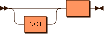

```
like_opt ::= NOT? LIKE
```

Referenced by: `wclause`

### escape\_opt: Escaping Special Characters

If you are using a `LIKE` clause to look for a string pattern, you may need to escape special characters like `'`, which are part of the LFQL syntax. To include `'` within your search strings, add an additional `'`. Two consecutive `'` characters are treated as a single `'` character within the search string. However, if you want to escape other characters like '%', you may need to specify a custom escape character, which is where `escape_opt` comes in. For example, if I want to filter for results containing '%', I can specify the escape character '\' as follows: `SELECT column FROM table
 WHERE column LIKE '%\%%' ESCAPE '\'`

            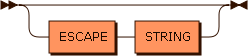

```
escape_opt
         ::= ( ESCAPE STRING )?
```

Referenced by: `wclause`

### between\_opt: Restricting Results Based on Range of Values

You can filter the results you get by demanding that certain column values in their rows be within a  range of values. This can apply to numbers or to other ordered quantities like dates and times.

            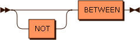'

```
between_opt
         ::= NOT? BETWEEN
```

Referenced by: `wclause`

### contains\_var: Full Text Search

The branch of the diagram with `contains_var` represents the grammar of a full-text search. `IDENT` would be the type of object (file name, tag comments, etc.) within which you are looking for the string of interest.

            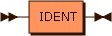

```
contains_var
         ::= IDENT
```

Referenced by: `wclause`

### exp: Expressions

We saw that in the `WHERE` clause, you can restrict your results based on whether they satisfy certain conditions, which are made up of expressions connected by logical, arithmetical, or string manipulation operators. `exp` shows the substructure of expressions. Expressions can be made up of smaller expressions combined by the another set of arithmetical and string operators. `DBLPIPE` refers to the `||` operator, which concatenates strings the same way it does in SQL. The `IDENT → LPAREN → explist_opt → RPAREN` path represents the situation where you use a [built-in function](../lfql-built-in-functions/) as an expression.

            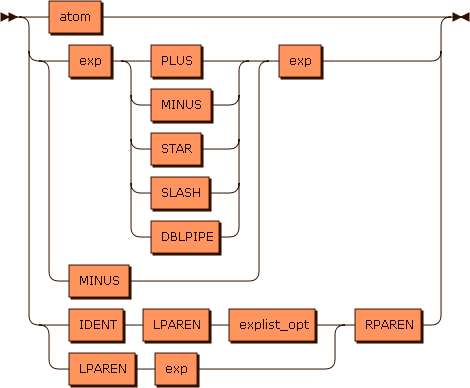

```
exp      ::= atom
           | ( exp ( PLUS | MINUS | STAR | SLASH | DBLPIPE ) | MINUS ) exp
           | ( IDENT LPAREN explist_opt | LPAREN exp ) RPAREN
```

Referenced by: `colspec`, `exp`, `explist_opt`, `wclause`

### explist\_opt: Arguments in Built-In Functions

`explist_opt` represents the arguments that go into built-in functions. It allows as many arguments as you need by always letting you put a comma at the end of the present arguments and add a new argument.

            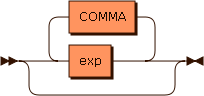

```
explist_opt
         ::= ( exp ( COMMA exp )* )?
```

Referenced by: `exp`

### atom: Basic Objects in Expressions

The `atom` type encompasses fixed objects that can be directly compared with other expressions. Examples would be the integer `37` and the string "fixedstring".

            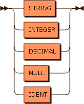

```
atom     ::= STRING
           | INTEGER
           | DECIMAL
           | NULL
           | IDENT
```

Referenced by: `exp`

## oclause\_opt: ORDER BY Clause

After the `WHERE` clause, you can order your query results according to multiple criteria. Each criterion is represented by one instance of `orderel`.

            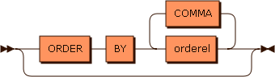

```
oclause_opt
         ::= ( ORDER BY orderel ( COMMA orderel )* )?
```

Referenced by: `stmt`

### orderel: Ordering Criteria

Ordering criteria can be based on the values of integers or on alphabetical order (`IDENT` represents identifying strings that start with a letter or an underscore).

            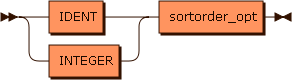

```
orderel  ::= ( IDENT | INTEGER ) sortorder_opt
```

Referenced by: `oclause_opt`

### sortorder\_opt: Ascending or Descending Order

For each ordering criterion, you can choose it to sort the results in ascending (`ASC`) or descending (`DESC`) order. If no option is selected, the results will be sorted in ascending order.

            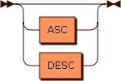

```
sortorder_opt
         ::= ( ASC | DESC )?
```

Referenced by: `orderel`

## Operator Precedence

Here is the operator precedence ordering, from highest to lowest. Operators on the same line have equal precedence.

- `(`, `)`
- `-` (unary)
- `*`, `/`
- `+`, `-` (binary)
- `=`, `<>`, `<`, `>`, `<=`, `>=`
- `NOT`
- `AND`
- `OR`

The `*`, `/`, `-` (binary), `+`, `AND`, and `OR` operators associate from left to right. The `-` (unary) and `NOT` operators associate from right to left. All other operators are non-associative.

## Rules for Basic Elements

`<IDENT>` follows the rules for identifiers:

- Contains letters, numbers, or the underscore
- Starts with a letter or underscore
- From 1 to 127 characters long
- Can be quoted with double-quotes, in which case a pair of double-quote characters is interpreted as a single double-quote
- Can have multiple segments separated by a dot; each segment follows the above rules

`<STRING>` is a literal string quoted with the `'` character. A pair of `'` characters embedded in a string is treated as a single `'` character.

`<NUMBER>` includes integers and decimal numbers. Numbers have the following formats specified with regular expressions:

- Decimal integers: `[-+]?[1-9][0-9]*`
- Octal integers: `[-+]?0[0-7]*`
- Hexadecimal integers: `[-+]?0[Xx][0-9a-fA-F]+`
- Decimals with a fractional portion: `[-+]?[0-9]*\.[0-9]+([Ee][-+]?[0-9]+)?`

`<DATE>` is a date with an optional time value. A `<DATE>` literal consists of the keyword `DATE` followed by a literal string containing a date and optional time in ISO-8601 format. For example: `DATE '2007-10-22 4:45:00'`. See the list of search examples for [sample date queries](../../searching-repositories/search-syntax/examples-in-advanced-search-syntax-and-lfql/#Date).

`<TIME>` is a time of day value. A `<TIME>` literal consists of the keyword `TIME` followed by a literal string specifying a time of day.
