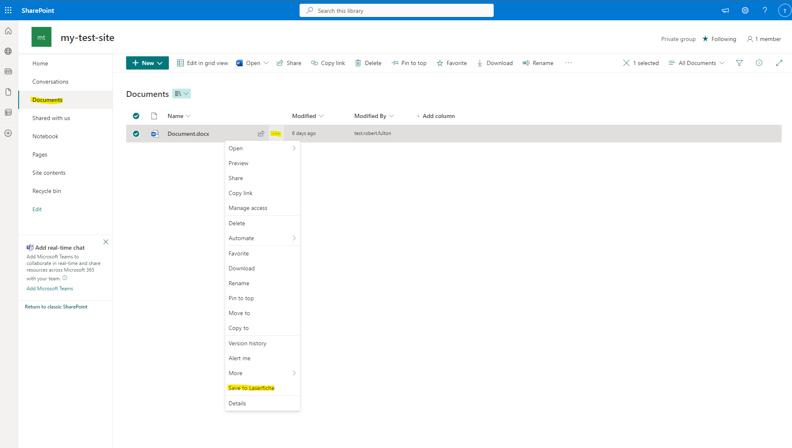

<!--Copyright (c) Laserfiche.
Licensed under the MIT License. See LICENSE in the project root for license information.-->

# Save a Document to Laserfiche

### Prerequisites

- Be able to open the documents tab in Laserfiche

### Steps

1. Navigate to the Documents tab in your SharePoint Site and choose which document you wish to send to Laserfiche.
1. Right-click on the entry you chose or select the ellipses to the right of the name.
   
1. Choose `Save to Laserfiche` from the drop-down menu.
1. If the Document saved, you should see the following message:
   
